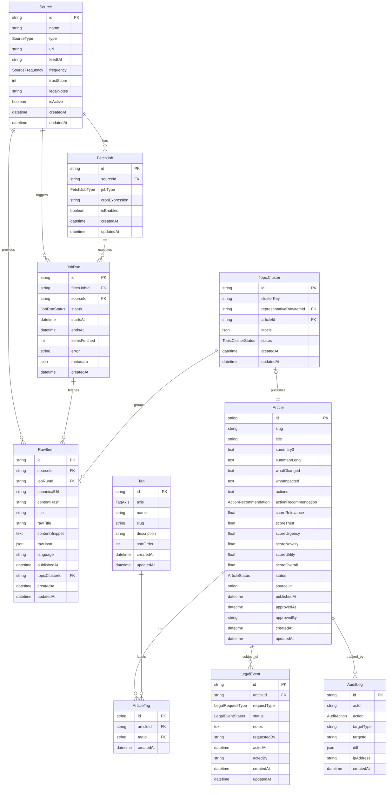
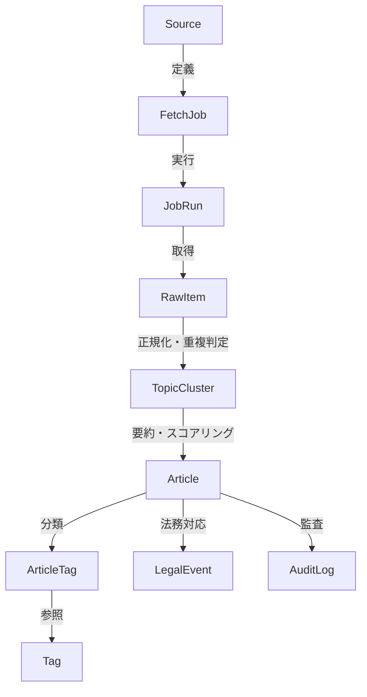
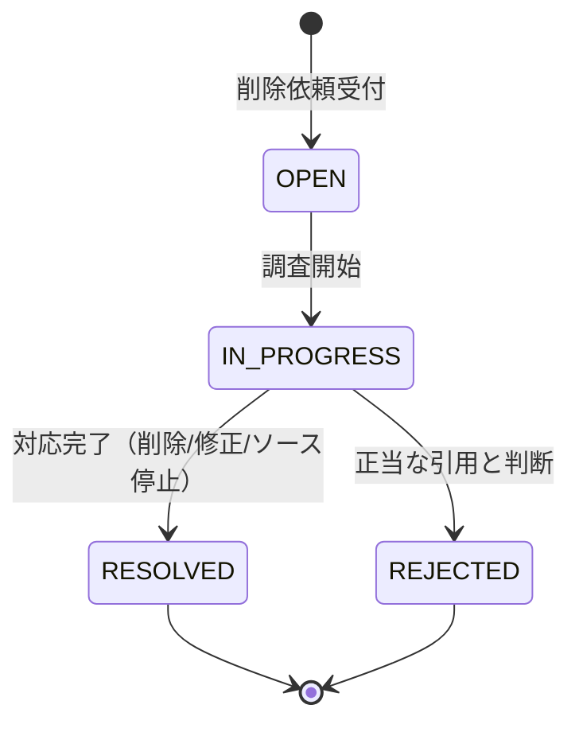

# データモデル設計書 — aiaiai

> 最終更新: 2026-02-27
> ステータス: MVP設計（v1.0）

---

## 目次

1. [設計方針](#1-設計方針)
2. [ER図（全体）](#2-er図全体)
3. [エンティティ詳細](#3-エンティティ詳細)
   - 3.1 [Source — 取得対象定義](#31-source--取得対象定義)
   - 3.2 [FetchJob — ジョブ定義](#32-fetchjob--ジョブ定義)
   - 3.3 [JobRun — ジョブ実行履歴](#33-jobrun--ジョブ実行履歴)
   - 3.4 [RawItem — 取得物（生データ）](#34-rawitem--取得物生データ)
   - 3.5 [TopicCluster — 重複統合単位](#35-topiccluster--重複統合単位)
   - 3.6 [Article — 公開単位](#36-article--公開単位)
   - 3.7 [Tag — 多軸分類](#37-tag--多軸分類)
   - 3.8 [ArticleTag — 記事-タグ中間テーブル](#38-articletag--記事-タグ中間テーブル)
   - 3.9 [LegalEvent — 法務・削除対応](#39-legalevent--法務削除対応)
   - 3.10 [AuditLog — 監査ログ](#310-auditlog--監査ログ)
4. [リレーションシップ一覧](#4-リレーションシップ一覧)
5. [インデックス戦略](#5-インデックス戦略)
6. [Enum定義](#6-enum定義)
7. [マイグレーション戦略](#7-マイグレーション戦略)
8. [将来拡張](#8-将来拡張)

---

## 1. 設計方針

### 基本原則

| 原則 | 説明 |
|---|---|
| **Raw/Cluster/Article分離** | 取得物（RawItem）→ 重複統合（TopicCluster）→ 公開記事（Article）の3層に分離し、パイプラインの各段階を独立して管理可能にする |
| **公式一次情報優先** | Source.typeとSource.trustScoreで情報源の信頼度を明示し、代表記事決定に利用する |
| **監査可能性** | すべての法務・運用操作をAuditLogとLegalEventで追跡可能にする |
| **拡張容易性** | 新しいソース種別やタグ軸の追加が既存スキーマの破壊的変更なしに可能 |
| **PostgreSQL最適化** | MVP段階ではPostgreSQLのFTS（全文検索）やGIN/GiSTインデックスを活用し、外部検索エンジンなしで運用 |

### 命名規約

- テーブル名: PascalCase（Prisma規約）
- カラム名: camelCase
- Enum名: PascalCase、値は UPPER_SNAKE_CASE
- タイムスタンプ: すべてUTC（`DateTime`型）で保存、表示時にAsia/Tokyoへ変換
- 主キー: UUID v4（`@default(uuid())`）を全テーブルで使用

---

## 2. ER図（全体）



### データフロー概念図



---

## 3. エンティティ詳細

### 3.1 Source — 取得対象定義

**目的**: 情報取得先の定義と管理。公式一次情報を最優先とする信頼度ヒエラルキーをここで制御する。

| フィールド | 型 | 必須 | デフォルト | 説明 |
|---|---|---|---|---|
| `id` | `String` (UUID) | Yes | `uuid()` | 主キー |
| `name` | `String` | Yes | — | ソース表示名（例: "OpenAI Developers Changelog"） |
| `type` | `SourceType` (Enum) | Yes | — | ソース種別: `OFFICIAL` / `RSS` / `GITHUB` / `X` / `BLOG` |
| `url` | `String` | Yes | — | ソースのメインURL |
| `feedUrl` | `String?` | No | `null` | RSS/Atomフィード等のURL（取得に使用） |
| `githubRepo` | `String?` | No | `null` | GitHubリポジトリ（`owner/repo`形式、GITHUB typeの場合） |
| `frequency` | `SourceFrequency` (Enum) | Yes | `DAILY` | 取得頻度: `HOURLY` / `DAILY` / `WEEKLY` / `MANUAL` |
| `trustScore` | `Int` | Yes | `50` | 信頼スコア（0-100）。公式=90-100、準一次=60-80、二次=40-60、SNS=10-30 |
| `legalNotes` | `String?` | No | `null` | 利用規約・法務上の注意事項（例: "X API利用規約に基づく。スクレイピング禁止"） |
| `robotsTxtCache` | `String?` | No | `null` | 対象サイトのrobots.txtキャッシュ（尊重確認用） |
| `lastFetchedAt` | `DateTime?` | No | `null` | 最終取得成功日時 |
| `isActive` | `Boolean` | Yes | `true` | 有効/無効。無効化されたソースはFetchJobで取得対象外 |
| `metadata` | `Json?` | No | `null` | ソース固有の追加設定（ヘッダー情報、認証種別等） |
| `createdAt` | `DateTime` | Yes | `now()` | 作成日時 |
| `updatedAt` | `DateTime` | Yes | `@updatedAt` | 更新日時 |

**信頼スコアガイドライン**:

| ソース種別 | trustScore範囲 | 例 |
|---|---|---|
| 公式リリースノート・changelog | 90-100 | OpenAI Developers Changelog, Claude Release Notes |
| GitHub Releases（公式リポ） | 85-95 | anthropics/claude-code Releases |
| 準一次情報（公認ブログ等） | 60-80 | 公式テックブログ |
| 二次情報（ニュースメディア） | 40-60 | TechCrunch等の記事 |
| SNS（X等） | 10-30 | 公式Xアカウント投稿 |

**リレーション**:
- `1:N` → `FetchJob`: 1つのソースに対して複数のジョブを定義可能
- `1:N` → `JobRun`: ソースに紐づくジョブ実行履歴
- `1:N` → `RawItem`: ソースから取得された全アイテム

---

### 3.2 FetchJob — ジョブ定義

**目的**: ソースごとの取得ジョブを定義。cronスケジュール、取得方式等を管理する。

| フィールド | 型 | 必須 | デフォルト | 説明 |
|---|---|---|---|---|
| `id` | `String` (UUID) | Yes | `uuid()` | 主キー |
| `sourceId` | `String` (FK) | Yes | — | 対象ソースID |
| `jobType` | `FetchJobType` (Enum) | Yes | — | 取得方式: `RSS` / `HTML_SCRAPE` / `GITHUB_RELEASES` / `GITHUB_CHANGELOG` / `X_API` / `X_EMBED` / `MANUAL` |
| `cronExpression` | `String?` | No | `null` | cronスケジュール式（例: `"0 5 * * *"`）。nullの場合手動実行のみ |
| `isEnabled` | `Boolean` | Yes | `true` | ジョブの有効/無効 |
| `maxRetries` | `Int` | Yes | `3` | 最大リトライ回数 |
| `backoffSeconds` | `Int` | Yes | `60` | リトライ間隔（秒）。指数バックオフの基底値 |
| `timeoutSeconds` | `Int` | Yes | `30` | タイムアウト（秒） |
| `metadata` | `Json?` | No | `null` | ジョブ固有の設定（GitHubトークン、ページングパラメータ等） |
| `createdAt` | `DateTime` | Yes | `now()` | 作成日時 |
| `updatedAt` | `DateTime` | Yes | `@updatedAt` | 更新日時 |

**リレーション**:
- `N:1` → `Source`: 親ソース
- `1:N` → `JobRun`: このジョブの実行履歴

---

### 3.3 JobRun — ジョブ実行履歴

**目的**: 各ジョブ実行のステータス、実行時刻、取得件数、エラー等を記録。リトライ管理や運用監視に使用する。

| フィールド | 型 | 必須 | デフォルト | 説明 |
|---|---|---|---|---|
| `id` | `String` (UUID) | Yes | `uuid()` | 主キー |
| `fetchJobId` | `String` (FK) | Yes | — | 実行元ジョブID |
| `sourceId` | `String` (FK) | Yes | — | ソースID（非正規化: JOIN削減のため保持） |
| `status` | `JobRunStatus` (Enum) | Yes | `PENDING` | `PENDING` / `RUNNING` / `SUCCESS` / `FAILED` / `CANCELLED` |
| `startsAt` | `DateTime?` | No | `null` | 実行開始日時 |
| `endsAt` | `DateTime?` | No | `null` | 実行完了日時 |
| `itemsFetched` | `Int` | Yes | `0` | 取得アイテム数 |
| `itemsCreated` | `Int` | Yes | `0` | 新規作成されたRawItem数 |
| `itemsSkipped` | `Int` | Yes | `0` | 重複等でスキップされた数 |
| `error` | `String?` | No | `null` | エラーメッセージ（失敗時） |
| `errorDetail` | `Json?` | No | `null` | エラー詳細（スタックトレース、HTTPステータス等） |
| `retryCount` | `Int` | Yes | `0` | 現在のリトライ回数 |
| `metadata` | `Json?` | No | `null` | 実行時メタデータ（レート制限残数、ETag等） |
| `createdAt` | `DateTime` | Yes | `now()` | レコード作成日時 |

**リレーション**:
- `N:1` → `FetchJob`: 実行元ジョブ定義
- `N:1` → `Source`: ソース（非正規化参照）
- `1:N` → `RawItem`: この実行で取得されたアイテム

**運用メモ**:
- `startsAt`と`endsAt`の差分でジョブの実行時間を計測可能
- `itemsFetched`/`itemsCreated`/`itemsSkipped`で取得効率を監視
- 失敗ジョブは管理画面から再実行可能（新規JobRunとして記録）

---

### 3.4 RawItem — 取得物（生データ）

**目的**: 各ソースから取得された元データを最小限保持する。正規化前の原データを保持し、重複判定・Topic Cluster構築の入力となる。

| フィールド | 型 | 必須 | デフォルト | 説明 |
|---|---|---|---|---|
| `id` | `String` (UUID) | Yes | `uuid()` | 主キー |
| `sourceId` | `String` (FK) | Yes | — | 取得元ソースID |
| `jobRunId` | `String?` (FK) | No | `null` | 取得時のJobRun ID（手動インポート時はnull可） |
| `canonicalUrl` | `String` | Yes | — | 正規化済みURL（UTMパラメータ除去、末尾スラッシュ統一済み） |
| `originalUrl` | `String` | Yes | — | 取得時の元URL（正規化前） |
| `contentHash` | `String` | Yes | — | コンテンツのSHA-256ハッシュ。同一URLの更新検知に使用 |
| `title` | `String` | Yes | — | 正規化済みタイトル |
| `rawTitle` | `String` | Yes | — | 取得時の元タイトル（正規化前） |
| `contentSnippet` | `String?` | No | `null` | コンテンツ抜粋（要約生成の入力、全文転載回避のため最大500文字） |
| `rawJson` | `Json?` | No | `null` | ソース固有の生データ（GitHub Release JSON、RSS item等） |
| `language` | `String` | Yes | `"ja"` | 言語コード（`ja` / `en`） |
| `publishedAt` | `DateTime?` | No | `null` | ソース上の公開日時 |
| `fetchedAt` | `DateTime` | Yes | `now()` | 取得日時 |
| `topicClusterId` | `String?` (FK) | No | `null` | 所属するTopicCluster ID（重複統合後に設定） |
| `dedupeStatus` | `DedupeStatus` (Enum) | Yes | `PENDING` | `PENDING` / `MATCHED` / `UNIQUE` / `MANUAL_REVIEW` |
| `metadata` | `Json?` | No | `null` | 追加メタデータ（GitHubリリースタグ名、Xツイート埋め込みURL等） |
| `createdAt` | `DateTime` | Yes | `now()` | 作成日時 |
| `updatedAt` | `DateTime` | Yes | `@updatedAt` | 更新日時 |

**重要な設計判断**:
- **全文転載の回避**: `contentSnippet`は最大500文字に制限。全文はrawJsonに構造化データとして保持するが、公開ページには出力しない
- **canonicalUrl**: 正規化済みURLはユニーク制約付き。同一URLの重複取得を防止
- **contentHash**: URL変更なしのコンテンツ更新（例: 公式ページの追記）を検知可能

**リレーション**:
- `N:1` → `Source`: 取得元ソース
- `N:1` → `JobRun`: 取得時のジョブ実行
- `N:1` → `TopicCluster`: 所属するトピッククラスタ

---

### 3.5 TopicCluster — 重複統合単位

**目的**: 複数ソースから取得された同一トピックのRawItemを1つのクラスタに統合する。代表記事を決定し、Articleとして公開する単位。

| フィールド | 型 | 必須 | デフォルト | 説明 |
|---|---|---|---|---|
| `id` | `String` (UUID) | Yes | `uuid()` | 主キー |
| `clusterKey` | `String` | Yes | — | クラスタの一意識別子（正規化タイトル+日付等から生成） |
| `representativeRawItemId` | `String?` (FK) | No | `null` | 代表RawItem ID（信頼度ヒエラルキーで決定） |
| `articleId` | `String?` (FK) | No | `null` | 生成されたArticle ID（要約生成後に設定） |
| `labels` | `Json?` | No | `null` | クラスタラベル（自動分類結果、例: `{"product": "ChatGPT", "type": "release"}`) |
| `matchMethod` | `MatchMethod` (Enum) | Yes | `URL_EXACT` | マッチ方式: `URL_EXACT` / `TITLE_SIMILARITY` / `CONTENT_SIMILARITY` / `MANUAL` |
| `matchScore` | `Float?` | No | `null` | マッチスコア（0.0-1.0）。手動マッチの場合はnull |
| `status` | `TopicClusterStatus` (Enum) | Yes | `ACTIVE` | `ACTIVE` / `MERGED` / `ARCHIVED` |
| `itemCount` | `Int` | Yes | `1` | クラスタ内のRawItem数 |
| `createdAt` | `DateTime` | Yes | `now()` | 作成日時 |
| `updatedAt` | `DateTime` | Yes | `@updatedAt` | 更新日時 |

**代表記事決定ロジック**:

クラスタ内のRawItemから、以下のヒエラルキーで代表（`representativeRawItemId`）を決定する:

```
公式（OFFICIAL, trustScore 90-100）
  > GitHub Releases（GITHUB, trustScore 85-95）
    > 準一次情報（RSS/BLOG, trustScore 60-80）
      > 二次情報（trustScore 40-60）
        > SNS（X, trustScore 10-30）
```

同スコアの場合は`publishedAt`が早い方を代表とする。

**リレーション**:
- `1:N` → `RawItem`: クラスタに所属するアイテム群
- `1:1` → `RawItem` (representative): 代表アイテム
- `1:0..1` → `Article`: 公開記事（未作成の場合null）

---

### 3.6 Article — 公開単位

**目的**: TopicClusterから生成された公開記事。実務者向け再構成要約、スコアリング結果、公開ステータスを管理する。UIに表示される最終的なエンティティ。

| フィールド | 型 | 必須 | デフォルト | 説明 |
|---|---|---|---|---|
| `id` | `String` (UUID) | Yes | `uuid()` | 主キー |
| `slug` | `String` | Yes | — | URL用スラッグ（ユニーク）。例: `"chatgpt-gpt4o-update-2026-02"` |
| `title` | `String` | Yes | — | 記事タイトル（日本語） |
| `summary3` | `String` | Yes | — | 3行要約（一覧表示用、改行区切り） |
| `summaryLong` | `String?` | No | `null` | 詳細要約（記事ページ用） |
| `whatChanged` | `String?` | No | `null` | 何が新しいか（差分説明） |
| `whoImpacted` | `String?` | No | `null` | 誰に影響があるか（対象ペルソナ・レベル） |
| `actions` | `String?` | No | `null` | 実務でどう使えるか（ユースケース・推奨アクション） |
| `actionRecommendation` | `ActionRecommendation` (Enum) | Yes | `MONITOR` | 推奨アクション: `TRY` / `MONITOR` / `IGNORE` |
| `sourceUrl` | `String` | Yes | — | 原典URL（必須、出典明記） |
| `relatedUrls` | `Json?` | No | `null` | 関連URL一覧（クラスタ内の他ソースURL等） |
| `scoreRelevance` | `Float` | Yes | `0` | 信頼性スコア（0-100） |
| `scoreTrust` | `Float` | Yes | `0` | 重要度スコア（0-100） |
| `scoreUrgency` | `Float` | Yes | `0` | 緊急度スコア（0-100） |
| `scoreNovelty` | `Float` | Yes | `0` | 新規性スコア（0-100） |
| `scoreUtility` | `Float` | Yes | `0` | 実務有用性スコア（0-100） |
| `scoreOverall` | `Float` | Yes | `0` | 総合スコア（重み付き加重平均、0-100） |
| `status` | `ArticleStatus` (Enum) | Yes | `DRAFT` | `DRAFT` / `REVIEW` / `PUBLISHED` / `UNPUBLISHED` / `DELETED` |
| `publishedAt` | `DateTime?` | No | `null` | 公開日時 |
| `approvedAt` | `DateTime?` | No | `null` | 承認日時 |
| `approvedBy` | `String?` | No | `null` | 承認者 |
| `seoTitle` | `String?` | No | `null` | SEO用タイトル（未設定時はtitleを使用） |
| `seoDescription` | `String?` | No | `null` | SEO用ディスクリプション（未設定時はsummary3を使用） |
| `ogImageUrl` | `String?` | No | `null` | OGP画像URL |
| `viewCount` | `Int` | Yes | `0` | 閲覧数（将来のスコア調整に使用） |
| `createdAt` | `DateTime` | Yes | `now()` | 作成日時 |
| `updatedAt` | `DateTime` | Yes | `@updatedAt` | 更新日時 |

**スコアリング計算式**（MVP初期重み）:

```
scoreOverall = scoreRelevance * 0.30
             + scoreUtility  * 0.25
             + scoreTrust    * 0.20
             + scoreNovelty  * 0.15
             + scoreUrgency  * 0.10
```

> 重みは `docs/scoring-ranking-design.md` で詳細定義。将来的にユーザー行動（クリック、保存、滞在時間）で調整可能とする。

**リレーション**:
- `1:1` → `TopicCluster`: 元のトピッククラスタ
- `1:N` → `ArticleTag`: 記事に付与されたタグ
- `1:N` → `LegalEvent`: 法務対応履歴
- `1:N` → `AuditLog`: 監査ログ（targetType="Article"で参照）

---

### 3.7 Tag — 多軸分類

**目的**: 記事の分類に使用するタグ。4つの軸（プロダクト・テーマ・レベル・実務用途）でフィルタリングと検索を実現する。

| フィールド | 型 | 必須 | デフォルト | 説明 |
|---|---|---|---|---|
| `id` | `String` (UUID) | Yes | `uuid()` | 主キー |
| `axis` | `TagAxis` (Enum) | Yes | — | 分類軸: `PRODUCT` / `THEME` / `LEVEL` / `USECASE` |
| `name` | `String` | Yes | — | 表示名（日本語。例: "ChatGPT", "API変更", "L3:実装"） |
| `slug` | `String` | Yes | — | URL用スラッグ（例: `"chatgpt"`, `"api-change"`, `"l3-implementation"`） |
| `description` | `String?` | No | `null` | タグの説明（管理画面用） |
| `sortOrder` | `Int` | Yes | `0` | 表示順序 |
| `color` | `String?` | No | `null` | バッジ色（CSSカラーコード） |
| `isActive` | `Boolean` | Yes | `true` | 有効/無効 |
| `createdAt` | `DateTime` | Yes | `now()` | 作成日時 |
| `updatedAt` | `DateTime` | Yes | `@updatedAt` | 更新日時 |

**軸ごとの初期タグ（seed）**:

| 軸 | タグ例 |
|---|---|
| `PRODUCT` | ChatGPT, OpenAI API, Claude, Claude Code, Gemini, Gemini API |
| `THEME` | Update, Pricing, Policy, Security, How-to, Breaking Change, New Feature |
| `LEVEL` | L1:活用, L2:定着/自動化, L3:実装 |
| `USECASE` | 経営, 企画, 開発, CS, 法務, マーケティング |

**ユニーク制約**: `@@unique([axis, slug])` — 同一軸内でスラッグの重複を禁止

**リレーション**:
- `1:N` → `ArticleTag`: このタグが付与された記事

---

### 3.8 ArticleTag — 記事-タグ中間テーブル

**目的**: ArticleとTagの多対多リレーションを実現する中間テーブル。

| フィールド | 型 | 必須 | デフォルト | 説明 |
|---|---|---|---|---|
| `id` | `String` (UUID) | Yes | `uuid()` | 主キー |
| `articleId` | `String` (FK) | Yes | — | 記事ID |
| `tagId` | `String` (FK) | Yes | — | タグID |
| `confidence` | `Float?` | No | `null` | 自動分類の確信度（0.0-1.0）。手動付与の場合はnull |
| `createdAt` | `DateTime` | Yes | `now()` | 作成日時 |

**ユニーク制約**: `@@unique([articleId, tagId])` — 同一記事に同一タグの重複付与を禁止

**リレーション**:
- `N:1` → `Article`: 記事
- `N:1` → `Tag`: タグ

---

### 3.9 LegalEvent — 法務・削除対応

**目的**: 削除依頼、著作権侵害通知、ソース遮断要請等の法務関連イベントを記録・管理する。即時対応可能な運用を支える。

| フィールド | 型 | 必須 | デフォルト | 説明 |
|---|---|---|---|---|
| `id` | `String` (UUID) | Yes | `uuid()` | 主キー |
| `articleId` | `String?` (FK) | No | `null` | 対象記事ID（記事単位の場合） |
| `sourceId` | `String?` (FK) | No | `null` | 対象ソースID（ソース遮断の場合） |
| `requestType` | `LegalRequestType` (Enum) | Yes | — | `TAKEDOWN` / `COPYRIGHT` / `SOURCE_BLOCK` / `CORRECTION` / `OTHER` |
| `status` | `LegalEventStatus` (Enum) | Yes | `OPEN` | `OPEN` / `IN_PROGRESS` / `RESOLVED` / `REJECTED` |
| `notes` | `String?` | No | `null` | 対応内容・経緯の記録 |
| `requestedBy` | `String?` | No | `null` | 依頼者（名前またはメールアドレス） |
| `requestedAt` | `DateTime` | Yes | `now()` | 依頼受付日時 |
| `actedAt` | `DateTime?` | No | `null` | 対応実行日時 |
| `actedBy` | `String?` | No | `null` | 対応実行者 |
| `resolution` | `String?` | No | `null` | 解決内容（非公開化、修正、却下理由等） |
| `createdAt` | `DateTime` | Yes | `now()` | 作成日時 |
| `updatedAt` | `DateTime` | Yes | `@updatedAt` | 更新日時 |

**運用フロー**:



**対応アクションの種類**:
- `TAKEDOWN`: 記事の非公開化（Article.status → `UNPUBLISHED`）
- `COPYRIGHT`: 引用部分の削除・修正
- `SOURCE_BLOCK`: ソースの無効化（Source.isActive → `false`）
- `CORRECTION`: 誤情報の修正

**リレーション**:
- `N:1` → `Article`: 対象記事（任意）
- `N:1` → `Source`: 対象ソース（任意）

---

### 3.10 AuditLog — 監査ログ

**目的**: すべての重要操作を記録する監査ログ。法務対応、記事の承認/非公開、ソースの設定変更等をトレース可能にする。

| フィールド | 型 | 必須 | デフォルト | 説明 |
|---|---|---|---|---|
| `id` | `String` (UUID) | Yes | `uuid()` | 主キー |
| `actor` | `String` | Yes | — | 操作者（ユーザー名、"system"、"cron"等） |
| `action` | `AuditAction` (Enum) | Yes | — | 操作種別 |
| `targetType` | `String` | Yes | — | 操作対象の型（`"Article"`, `"Source"`, `"TopicCluster"`等） |
| `targetId` | `String` | Yes | — | 操作対象のID |
| `diff` | `Json?` | No | `null` | 変更差分（例: `{"status": {"from": "DRAFT", "to": "PUBLISHED"}}`) |
| `reason` | `String?` | No | `null` | 操作理由（特に削除・非公開時に必須） |
| `ipAddress` | `String?` | No | `null` | 操作者のIPアドレス |
| `userAgent` | `String?` | No | `null` | 操作者のUser-Agent |
| `createdAt` | `DateTime` | Yes | `now()` | 操作日時 |

**AuditAction Enum値**:

| 値 | 説明 |
|---|---|
| `ARTICLE_CREATED` | 記事作成 |
| `ARTICLE_PUBLISHED` | 記事公開 |
| `ARTICLE_UNPUBLISHED` | 記事非公開化 |
| `ARTICLE_DELETED` | 記事削除 |
| `ARTICLE_UPDATED` | 記事更新 |
| `ARTICLE_APPROVED` | 記事承認 |
| `SOURCE_CREATED` | ソース追加 |
| `SOURCE_UPDATED` | ソース更新 |
| `SOURCE_DISABLED` | ソース無効化 |
| `SOURCE_ENABLED` | ソース有効化 |
| `CLUSTER_MERGED` | クラスタ統合 |
| `CLUSTER_SPLIT` | クラスタ分割 |
| `TAG_ASSIGNED` | タグ付与 |
| `TAG_REMOVED` | タグ削除 |
| `LEGAL_EVENT_CREATED` | 法務イベント作成 |
| `LEGAL_EVENT_RESOLVED` | 法務イベント解決 |
| `JOB_MANUAL_RUN` | ジョブ手動実行 |
| `SETTINGS_CHANGED` | 設定変更 |

**設計メモ**:
- AuditLogはAppend-only（追記のみ）とし、既存レコードの更新・削除は原則禁止
- `targetType` + `targetId` の組み合わせで任意のエンティティの変更履歴を追跡可能
- `diff`フィールドにJSONで変更前後の値を記録し、「何が変わったか」を確認可能

---

## 4. リレーションシップ一覧

| 元テーブル | 関係 | 先テーブル | 外部キー | 説明 |
|---|---|---|---|---|
| Source | 1:N | FetchJob | `FetchJob.sourceId` | 1つのソースに複数のジョブ定義 |
| Source | 1:N | JobRun | `JobRun.sourceId` | 非正規化参照（JOIN削減） |
| Source | 1:N | RawItem | `RawItem.sourceId` | ソースから取得した全アイテム |
| Source | 1:N | LegalEvent | `LegalEvent.sourceId` | ソース遮断等の法務イベント |
| FetchJob | 1:N | JobRun | `JobRun.fetchJobId` | ジョブ定義から実行履歴 |
| JobRun | 1:N | RawItem | `RawItem.jobRunId` | 実行ごとに取得したアイテム |
| TopicCluster | 1:N | RawItem | `RawItem.topicClusterId` | クラスタに属するアイテム群 |
| TopicCluster | 1:1 | RawItem (rep.) | `TopicCluster.representativeRawItemId` | 代表アイテム |
| TopicCluster | 1:0..1 | Article | `TopicCluster.articleId` | 公開記事 |
| Article | 1:N | ArticleTag | `ArticleTag.articleId` | 記事のタグ付け |
| Tag | 1:N | ArticleTag | `ArticleTag.tagId` | タグの使用先 |
| Article | 1:N | LegalEvent | `LegalEvent.articleId` | 記事の法務イベント |

---

## 5. インデックス戦略

### 主キー・ユニーク制約

| テーブル | インデックス | 種類 | 目的 |
|---|---|---|---|
| Source | `id` | PK | 主キー |
| Source | `url` | UNIQUE | URL重複防止 |
| FetchJob | `id` | PK | 主キー |
| JobRun | `id` | PK | 主キー |
| RawItem | `id` | PK | 主キー |
| RawItem | `canonicalUrl` | UNIQUE | 正規化URL重複防止 |
| TopicCluster | `id` | PK | 主キー |
| TopicCluster | `clusterKey` | UNIQUE | クラスタキー重複防止 |
| Article | `id` | PK | 主キー |
| Article | `slug` | UNIQUE | スラッグ重複防止 |
| Tag | `id` | PK | 主キー |
| Tag | `[axis, slug]` | UNIQUE（複合） | 軸内スラッグ重複防止 |
| ArticleTag | `id` | PK | 主キー |
| ArticleTag | `[articleId, tagId]` | UNIQUE（複合） | 重複付与防止 |
| LegalEvent | `id` | PK | 主キー |
| AuditLog | `id` | PK | 主キー |

### パフォーマンス用インデックス

| テーブル | インデックス | 種類 | 目的 |
|---|---|---|---|
| RawItem | `sourceId` | B-tree | ソース別アイテム検索 |
| RawItem | `jobRunId` | B-tree | ジョブ実行別アイテム検索 |
| RawItem | `topicClusterId` | B-tree | クラスタ別アイテム検索 |
| RawItem | `publishedAt` | B-tree | 日時順ソート |
| RawItem | `contentHash` | B-tree | コンテンツハッシュによる重複検出 |
| RawItem | `dedupeStatus` | B-tree | 重複処理ステータス絞り込み |
| JobRun | `fetchJobId` | B-tree | ジョブ別実行履歴 |
| JobRun | `sourceId` | B-tree | ソース別実行履歴 |
| JobRun | `status` | B-tree | ステータス別検索 |
| JobRun | `startsAt` | B-tree | 時系列表示 |
| Article | `status` | B-tree | ステータス別検索（公開記事一覧等） |
| Article | `publishedAt` | B-tree | 公開日時順ソート |
| Article | `scoreOverall` | B-tree | スコア順ソート |
| Article | `[status, publishedAt]` | B-tree（複合） | 公開記事の日時順表示（最頻出クエリ） |
| Article | `[status, scoreOverall]` | B-tree（複合） | 公開記事のスコア順表示 |
| ArticleTag | `articleId` | B-tree | 記事のタグ取得 |
| ArticleTag | `tagId` | B-tree | タグ別記事検索 |
| LegalEvent | `articleId` | B-tree | 記事別法務イベント |
| LegalEvent | `status` | B-tree | 未対応イベント検索 |
| AuditLog | `[targetType, targetId]` | B-tree（複合） | 対象別監査ログ検索 |
| AuditLog | `actor` | B-tree | 操作者別検索 |
| AuditLog | `createdAt` | B-tree | 時系列表示 |

### 全文検索用インデックス（PostgreSQL FTS）

```sql
-- 記事の全文検索（日本語対応）
CREATE INDEX idx_article_fts ON "Article"
  USING GIN (to_tsvector('simple', coalesce(title, '') || ' ' || coalesce(summary3, '') || ' ' || coalesce("summaryLong", '')));

-- RawItemのタイトル検索（重複判定補助）
CREATE INDEX idx_rawitem_title_fts ON "RawItem"
  USING GIN (to_tsvector('simple', coalesce(title, '')));
```

> **注意**: MVP段階では`simple`設定を使用。日本語形態素解析が必要な場合はpg_bigmまたはMeilisearch等への移行を検討する。

---

## 6. Enum定義

```prisma
// ソース種別
enum SourceType {
  OFFICIAL    // 公式リリースノート・changelog
  RSS         // RSSフィード
  GITHUB      // GitHub Releases / CHANGELOG
  X           // X（Twitter）API/埋め込み
  BLOG        // ブログ・メディア記事
}

// ソース取得頻度
enum SourceFrequency {
  HOURLY      // 1時間ごと
  DAILY       // 日次
  WEEKLY      // 週次
  MANUAL      // 手動のみ
}

// ジョブ種別
enum FetchJobType {
  RSS               // RSS/Atomフィード取得
  HTML_SCRAPE       // HTML解析（robots.txt尊重）
  GITHUB_RELEASES   // GitHub Releases API
  GITHUB_CHANGELOG  // GitHub CHANGELOG.md解析
  X_API             // X API
  X_EMBED           // X埋め込み
  MANUAL            // 手動入力
}

// ジョブ実行ステータス
enum JobRunStatus {
  PENDING     // 待機中
  RUNNING     // 実行中
  SUCCESS     // 成功
  FAILED      // 失敗
  CANCELLED   // キャンセル
}

// 重複判定ステータス
enum DedupeStatus {
  PENDING       // 未処理
  MATCHED       // 既存クラスタにマッチ
  UNIQUE        // 新規（ユニーク）
  MANUAL_REVIEW // 手動確認待ち
}

// マッチ方式
enum MatchMethod {
  URL_EXACT           // URL完全一致
  TITLE_SIMILARITY    // タイトル類似度
  CONTENT_SIMILARITY  // コンテンツ類似度（P1）
  MANUAL              // 手動統合
}

// トピッククラスタステータス
enum TopicClusterStatus {
  ACTIVE    // 有効
  MERGED    // 他クラスタに統合済み
  ARCHIVED  // アーカイブ
}

// 記事ステータス
enum ArticleStatus {
  DRAFT         // 下書き（自動生成直後）
  REVIEW        // レビュー待ち
  PUBLISHED     // 公開中
  UNPUBLISHED   // 非公開（削除依頼等）
  DELETED       // 論理削除
}

// 推奨アクション
enum ActionRecommendation {
  TRY       // 今すぐ試すべき
  MONITOR   // 動向を注視
  IGNORE    // 多くのユーザーには影響なし
}

// タグ分類軸
enum TagAxis {
  PRODUCT   // プロダクト軸（ChatGPT, Claude等）
  THEME     // テーマ軸（Update, Security等）
  LEVEL     // レベル軸（L1, L2, L3）
  USECASE   // 実務用途軸（開発, 企画等）
}

// 法務リクエスト種別
enum LegalRequestType {
  TAKEDOWN      // 削除依頼
  COPYRIGHT     // 著作権侵害通知
  SOURCE_BLOCK  // ソース遮断要請
  CORRECTION    // 修正依頼
  OTHER         // その他
}

// 法務イベントステータス
enum LegalEventStatus {
  OPEN          // 受付
  IN_PROGRESS   // 対応中
  RESOLVED      // 解決済み
  REJECTED      // 却下
}

// 監査アクション
enum AuditAction {
  ARTICLE_CREATED
  ARTICLE_PUBLISHED
  ARTICLE_UNPUBLISHED
  ARTICLE_DELETED
  ARTICLE_UPDATED
  ARTICLE_APPROVED
  SOURCE_CREATED
  SOURCE_UPDATED
  SOURCE_DISABLED
  SOURCE_ENABLED
  CLUSTER_MERGED
  CLUSTER_SPLIT
  TAG_ASSIGNED
  TAG_REMOVED
  LEGAL_EVENT_CREATED
  LEGAL_EVENT_RESOLVED
  JOB_MANUAL_RUN
  SETTINGS_CHANGED
}
```

---

## 7. マイグレーション戦略

### 基本方針

| 項目 | 方針 |
|---|---|
| **ツール** | Prisma Migrate（`npx prisma migrate dev`） |
| **命名規約** | `YYYYMMDDHHMMSS_description`（例: `20260227120000_initial_schema`） |
| **ブランチ戦略** | フィーチャーブランチでマイグレーションファイルを作成し、PRレビュー後mainにマージ |
| **本番適用** | `npx prisma migrate deploy`（Vercelデプロイ時に自動実行） |
| **ロールバック** | Prisma Migrateはダウンマイグレーション非対応のため、逆操作のマイグレーションを新規作成 |

### MVP段階のマイグレーション手順

```bash
# 1. スキーマ定義
#    prisma/schema.prismaを編集

# 2. マイグレーション作成（開発環境）
npx prisma migrate dev --name initial_schema

# 3. クライアント再生成
npx prisma generate

# 4. シードデータ投入
npx prisma db seed

# 5. 本番デプロイ
npx prisma migrate deploy
```

### マイグレーション運用ルール

1. **破壊的変更の回避**: カラム削除やリネームは段階的に行う
   - Step 1: 新カラム追加、データ移行
   - Step 2: アプリケーションコード更新
   - Step 3: 旧カラム削除（次回マイグレーション）

2. **データ投入マイグレーション**: 大量データの投入・変換はマイグレーション内のSQLで実行

3. **インデックス追加**: パフォーマンスインデックスはアプリケーションと同時にデプロイ

4. **テスト環境での事前検証**: 本番適用前にステージング環境でマイグレーションを検証

### 将来のスキーマ拡張計画

| フェーズ | 変更内容 | 対象テーブル |
|---|---|---|
| P1 | ユーザーテーブル追加（会員機能） | 新規: `User`, `UserBookmark`, `UserPreference` |
| P1 | コンテンツ類似度テーブル（埋め込みベクトル） | 新規: `ContentEmbedding` |
| P1 | 通知設定テーブル | 新規: `NotificationConfig`, `NotificationLog` |
| P2 | APIキー管理 | 新規: `ApiKey`, `ApiUsageLog` |
| P2 | コメント/フィードバック | 新規: `Comment`, `Feedback` |
| P2 | 週次ダイジェスト | 新規: `WeeklyDigest`, `DigestArticle` |

---

## 8. 将来拡張

### ベクトル検索（pgvector）

P1フェーズでコンテンツ類似度による重複判定を強化する場合、PostgreSQLのpgvector拡張を導入予定:

```sql
-- pgvector拡張の有効化
CREATE EXTENSION vector;

-- コンテンツ埋め込みテーブル
CREATE TABLE "ContentEmbedding" (
  id UUID PRIMARY KEY DEFAULT gen_random_uuid(),
  "rawItemId" UUID REFERENCES "RawItem"(id),
  embedding vector(1536),  -- OpenAI text-embedding-3-small等
  "createdAt" TIMESTAMP DEFAULT now()
);

-- コサイン類似度検索用インデックス
CREATE INDEX idx_embedding_cosine ON "ContentEmbedding"
  USING ivfflat (embedding vector_cosine_ops) WITH (lists = 100);
```

### マルチテナント対応

法人向けダッシュボード（P2）では、テナント分離が必要:

- `Organization`テーブルの追加
- 各テーブルへの`organizationId`カラム追加
- Row Level Security（RLS）による行レベルアクセス制御

### パーティショニング

AuditLogやJobRunのようなログ系テーブルは、データ量増加に備えて時系列パーティショニングを検討:

```sql
-- 月次パーティショニング（例: AuditLog）
CREATE TABLE "AuditLog" (
  ...
) PARTITION BY RANGE ("createdAt");

CREATE TABLE "AuditLog_2026_02" PARTITION OF "AuditLog"
  FOR VALUES FROM ('2026-02-01') TO ('2026-03-01');
```

---

## 付録: Prisma Schema概要

以下は `prisma/schema.prisma` に反映する際の構造概要。実際のスキーマファイルはこのドキュメントと整合するように実装する。

```prisma
generator client {
  provider = "prisma-client-js"
}

datasource db {
  provider = "postgresql"
  url      = env("DATABASE_URL")
}

model Source {
  id             String          @id @default(uuid())
  name           String
  type           SourceType
  url            String          @unique
  feedUrl        String?
  githubRepo     String?
  frequency      SourceFrequency @default(DAILY)
  trustScore     Int             @default(50)
  legalNotes     String?
  robotsTxtCache String?
  lastFetchedAt  DateTime?
  isActive       Boolean         @default(true)
  metadata       Json?
  createdAt      DateTime        @default(now())
  updatedAt      DateTime        @updatedAt

  fetchJobs   FetchJob[]
  jobRuns     JobRun[]
  rawItems    RawItem[]
  legalEvents LegalEvent[]

  @@index([type])
  @@index([isActive])
}

model FetchJob {
  id              String       @id @default(uuid())
  sourceId        String
  jobType         FetchJobType
  cronExpression  String?
  isEnabled       Boolean      @default(true)
  maxRetries      Int          @default(3)
  backoffSeconds  Int          @default(60)
  timeoutSeconds  Int          @default(30)
  metadata        Json?
  createdAt       DateTime     @default(now())
  updatedAt       DateTime     @updatedAt

  source  Source   @relation(fields: [sourceId], references: [id])
  jobRuns JobRun[]

  @@index([sourceId])
  @@index([isEnabled])
}

model JobRun {
  id           String       @id @default(uuid())
  fetchJobId   String
  sourceId     String
  status       JobRunStatus @default(PENDING)
  startsAt     DateTime?
  endsAt       DateTime?
  itemsFetched Int          @default(0)
  itemsCreated Int          @default(0)
  itemsSkipped Int          @default(0)
  error        String?
  errorDetail  Json?
  retryCount   Int          @default(0)
  metadata     Json?
  createdAt    DateTime     @default(now())

  fetchJob FetchJob  @relation(fields: [fetchJobId], references: [id])
  source   Source    @relation(fields: [sourceId], references: [id])
  rawItems RawItem[]

  @@index([fetchJobId])
  @@index([sourceId])
  @@index([status])
  @@index([startsAt])
}

model RawItem {
  id              String      @id @default(uuid())
  sourceId        String
  jobRunId        String?
  canonicalUrl    String      @unique
  originalUrl     String
  contentHash     String
  title           String
  rawTitle        String
  contentSnippet  String?
  rawJson         Json?
  language        String      @default("ja")
  publishedAt     DateTime?
  fetchedAt       DateTime    @default(now())
  topicClusterId  String?
  dedupeStatus    DedupeStatus @default(PENDING)
  metadata        Json?
  createdAt       DateTime    @default(now())
  updatedAt       DateTime    @updatedAt

  source       Source        @relation(fields: [sourceId], references: [id])
  jobRun       JobRun?       @relation(fields: [jobRunId], references: [id])
  topicCluster TopicCluster? @relation("ClusterItems", fields: [topicClusterId], references: [id])

  representativeOf TopicCluster[] @relation("RepresentativeItem")

  @@index([sourceId])
  @@index([jobRunId])
  @@index([topicClusterId])
  @@index([publishedAt])
  @@index([contentHash])
  @@index([dedupeStatus])
}

model TopicCluster {
  id                      String             @id @default(uuid())
  clusterKey              String             @unique
  representativeRawItemId String?
  articleId               String?            @unique
  labels                  Json?
  matchMethod             MatchMethod        @default(URL_EXACT)
  matchScore              Float?
  status                  TopicClusterStatus @default(ACTIVE)
  itemCount               Int                @default(1)
  createdAt               DateTime           @default(now())
  updatedAt               DateTime           @updatedAt

  rawItems            RawItem[] @relation("ClusterItems")
  representativeItem  RawItem?  @relation("RepresentativeItem", fields: [representativeRawItemId], references: [id])
  article             Article?  @relation(fields: [articleId], references: [id])

  @@index([status])
}

model Article {
  id                   String               @id @default(uuid())
  slug                 String               @unique
  title                String
  summary3             String
  summaryLong          String?
  whatChanged           String?
  whoImpacted           String?
  actions              String?
  actionRecommendation ActionRecommendation @default(MONITOR)
  sourceUrl            String
  relatedUrls          Json?
  scoreRelevance       Float                @default(0)
  scoreTrust           Float                @default(0)
  scoreUrgency         Float                @default(0)
  scoreNovelty         Float                @default(0)
  scoreUtility         Float                @default(0)
  scoreOverall         Float                @default(0)
  status               ArticleStatus        @default(DRAFT)
  publishedAt          DateTime?
  approvedAt           DateTime?
  approvedBy           String?
  seoTitle             String?
  seoDescription       String?
  ogImageUrl           String?
  viewCount            Int                  @default(0)
  createdAt            DateTime             @default(now())
  updatedAt            DateTime             @updatedAt

  topicCluster TopicCluster?
  articleTags  ArticleTag[]
  legalEvents  LegalEvent[]

  @@index([status])
  @@index([publishedAt])
  @@index([scoreOverall])
  @@index([status, publishedAt])
  @@index([status, scoreOverall])
}

model Tag {
  id          String   @id @default(uuid())
  axis        TagAxis
  name        String
  slug        String
  description String?
  sortOrder   Int      @default(0)
  color       String?
  isActive    Boolean  @default(true)
  createdAt   DateTime @default(now())
  updatedAt   DateTime @updatedAt

  articleTags ArticleTag[]

  @@unique([axis, slug])
  @@index([axis])
  @@index([isActive])
}

model ArticleTag {
  id         String   @id @default(uuid())
  articleId  String
  tagId      String
  confidence Float?
  createdAt  DateTime @default(now())

  article Article @relation(fields: [articleId], references: [id])
  tag     Tag     @relation(fields: [tagId], references: [id])

  @@unique([articleId, tagId])
  @@index([articleId])
  @@index([tagId])
}

model LegalEvent {
  id          String             @id @default(uuid())
  articleId   String?
  sourceId    String?
  requestType LegalRequestType
  status      LegalEventStatus   @default(OPEN)
  notes       String?
  requestedBy String?
  requestedAt DateTime           @default(now())
  actedAt     DateTime?
  actedBy     String?
  resolution  String?
  createdAt   DateTime           @default(now())
  updatedAt   DateTime           @updatedAt

  article Article? @relation(fields: [articleId], references: [id])
  source  Source?  @relation(fields: [sourceId], references: [id])

  @@index([articleId])
  @@index([sourceId])
  @@index([status])
  @@index([requestType])
}

model AuditLog {
  id         String      @id @default(uuid())
  actor      String
  action     AuditAction
  targetType String
  targetId   String
  diff       Json?
  reason     String?
  ipAddress  String?
  userAgent  String?
  createdAt  DateTime    @default(now())

  @@index([targetType, targetId])
  @@index([actor])
  @@index([action])
  @@index([createdAt])
}
```

---

> **本ドキュメントの位置づけ**: 本データモデル設計書は `prisma/schema.prisma` の実装仕様書として機能する。スキーマ変更時は本ドキュメントも同時に更新すること。
