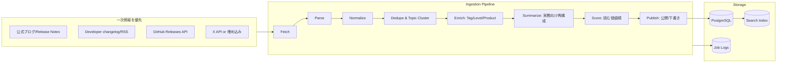
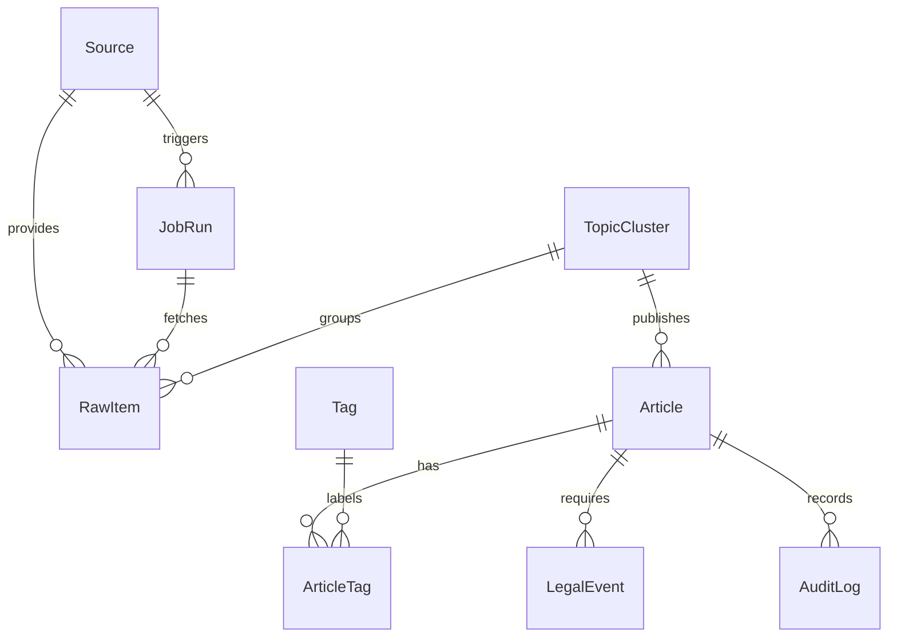
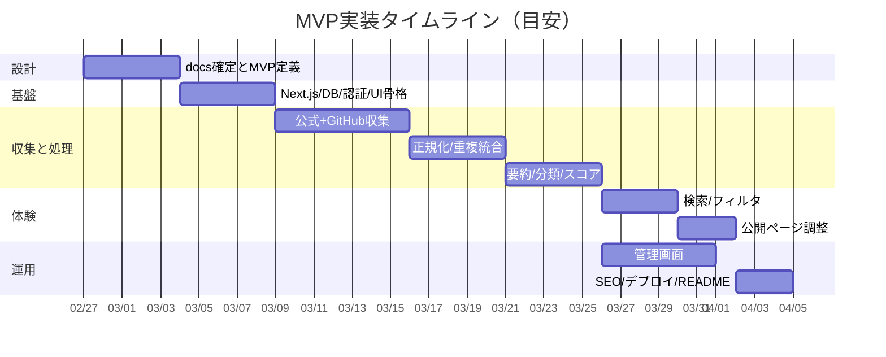

# Claude Codeで設計から実装まで自走する「AI情報統合サイト」マスタープロンプト最終版

## エグゼクティブサマリ

本レポートは、依頼者（吉田レベル想定）が **Claude Code に投入して、そのまま「調査→設計→実装→デプロイ→運用設計」まで進められる**“日々進化するAI情報を一手に集約する高品質情報サイト”の **超完璧なマスタープロンプト（コピペ可能な完全版）**を、実装要件・成果物・運用/法務・ロードマップまで含めて最終形にまとめたものです。Claude Code はコードベースを理解し、ファイル編集やコマンド実行まで行う「エージェント型のコーディング環境」であるため、成功率を最大化するには **検証可能な完了条件（tests / expected outputs）・Plan→Implement分離・権限/セキュリティ・コンテキスト管理**を要件として組み込む必要があります。citeturn0search8turn5view1

本プロダクトの核は「AIニュース転載」ではなく、**公式一次情報を最優先**に、GitHub Releases 等の構造化更新情報を取り込み、Xは規約に沿って（スクレイピング禁止、公開インターフェイスのみ）扱い、**重複統合（Topic Cluster）**と **実務者向け再構成要約（何が変わった/誰に効く/どう使う/今すぐ試すべきか）**で「読む価値順」に提示する点です。Xの利用規約（2026-01-15版）ではスクレイピング禁止と、公開されているインターフェイス以外でのアクセス禁止が明記されています。citeturn6view0turn1search11

収集は、公式ブログ/リリースノート（例：ChatGPTのリリースノート、OpenAI Developersのchangelog（RSSあり）、Claude Developer Platformのリリースノート、Claude CodeのCHANGELOG、Geminiの公式アップデート/リリースノート）を中心に設計し、GitHub Releases は GitHub REST API のレート制限（未認証60回/時など）と二次レート制限を前提にバックオフ制御を実装します。citeturn4search8turn11search2turn4search1turn4search2turn4search3turn11search5turn0search3turn0search11

SEO は Google Search Central の定石（robots.txtはインデックス除外ではない、sitemap、canonical、構造化データ（Article））を初期から満たし、運用面では「削除依頼」「ソース遮断」「誤情報（SNS速報）隔離」「監査ログ」を管理画面で吸収できるようにします。citeturn1search1turn2search0turn2search1turn1search5turn2search13  
法務面は日本の著作権法における引用要件（公表物・公正な慣行・正当な範囲・出所明示等）を満たし、**全文転載を避け、要約主体＋出典明記＋必要最小限の引用**へ寄せます。citeturn10view1

競合文脈として、日本国内にはAI/生成AIのニュース・解説メディア（例：entity["organization","ITmedia AI＋","japanese ai media"]、entity["organization","Ledge.ai","japanese ai news media"]、entity["organization","AINOW","japanese ai media"]、entity["organization","Publickey","japanese tech blog"] など）が存在しますが、本プロダクトは「記事制作」よりも **一次更新の集約・重複統合・実務判断の再構成**を差別化軸に置きます。citeturn3search4turn3search1turn3search2turn3search11

---

## 未指定事項と合理的仮定

### 未指定（要件として明記し、後から差し替え可能にする）
| 項目 | 状態 |
|---|---|
| サイト名/ブランド | 未指定 |
| ドメイン/運用主体（個人/法人） | 未指定 |
| 収益モデル（広告/スポンサー/会員/法人契約） | 未指定 |
| 想定SLA（更新遅延許容、障害対応時間） | 未指定 |
| LLM要約の利用先（Claude/OpenAI/Gemini等、どのAPIを使うか） | 未指定 |
| 予算上限（X API、LLMトークン、DB/監視費） | 未指定 |
| “吉田レベル”の精密定義（Biz寄り/開発寄り、業界） | 未指定 |

### 合理的仮定（MVP推進のためのデフォルト）
- 体制は「吉田＋AI（Claude Code）」中心の **1人開発**を想定し、MVPは **3〜4週間（約30人日）**で公開可能な範囲にスコープ制御する（後述ロードマップ）。  
- 情報源はまず **公式一次情報＋GitHub Releases＋（規約準拠の）X最小**に絞り、媒体系ソースはP1以降で追加する。citeturn6view0turn0search11turn0search3  
- 要約は「自動生成→管理画面で承認/修正」運用とし、自動100%公開はしない（誤要約・法務・信頼性の吸収）。citeturn10view1  

---

## 要件定義とMVP

### プロダクトコンセプトと差別化

**コンセプト**：AIの更新情報を、単に集めるのではなく **“使える順・関係ある順・理解しやすい順”に再構成する日本語プラットフォーム**。  
**差別化**：  
- 公式一次情報中心の「正確性」と「アップデート追跡性」citeturn11search2turn4search3turn4search2turn4search8  
- 重複統合（Topic Cluster）により「結局どれを読めばいいか」を1本に束ねる（代表記事は公式優先）citeturn2search7turn2search1  
- 実務者向け再構成要約（差分・影響・アクション）で、一覧だけで判断できる  
- Xは規約遵守の範囲で“速報補助”として扱い、裏取り前は隔離ラベル（誤情報対策）citeturn6view0turn1search11  

### 対象プロダクト/ソース一覧（優先：公式ブログ・GitHub Releases・主要X・日本語一次情報）

一次情報の代表例として、以下は「更新情報を継続提供している公式ハブ」としてMVPの中核に据えます。citeturn11search0turn11search2turn11search1turn4search1turn4search2turn4search3turn11search5

| 監視対象（例） | 公式一次情報（最優先） | 構造化更新（最優先） | X（補助・規約準拠） |
|---|---|---|---|
| ChatGPT/UI更新 | ChatGPT リリースノート（日本語含む）citeturn11search0 | — | 公式アカウント（API/埋め込みのみ）citeturn6view0 |
| OpenAI Developers/API | Developers changelog（RSSあり）citeturn11search2 / API changelogciteturn11search1 | GitHub Releases（公式SDK等）citeturn0search11 | 公式アカウント（同上）citeturn6view0 |
| Claude Developer Platform | Release notes（API/SDK/Console）citeturn4search1 | — | 公式アカウント（同上）citeturn6view0 |
| Claude Code | 公式CHANGELOG（GitHub）citeturn4search2 | GitHub Releasesciteturn4search16 | 公式アカウント（同上）citeturn6view0 |
| Gemini（アプリ/モデル） | 公式アップデートハブciteturn4search3 / アプリリリースノート（日本語あり）citeturn11search5 | Gemini API changelog（必要なら）citeturn11search9 | 公式アカウント（同上）citeturn6view0 |

### 想定ユーザーとペルソナ

国内のAIメディアは「ニュース/活用事例/ハウツー」を扱いますが、本プロダクトは「更新追跡と判断の高速化」を優先し、ユーザーも“実務導入〜実装”寄りに寄せます。citeturn3search4turn3search1turn3search2

| ペルソナ | 主な職種 | 欲しい価値 | 重要な表示要素 |
|---|---|---|---|
| Biz実装層 | 企画/マーケ/CS/営業企画 | 何が変わり、業務でどう効くか | 3行要約 / 使い道 / 次アクション |
| 開発導入層 | エンジニア/PM | API/SDK/破壊的変更/移行手順 | 変更点 / 影響範囲 / 実装メモ |
| 導入責任者層 | 情シス/管理職/経営 | 料金/規約/リスク/意思決定材料 | 重要度 / 信頼度 / リスク要約 |

### レベル分け基準（必ず明文化して分類ブレを防ぐ）

- **Level 1（活用）**：UI機能、使い方、運用Tips、チーム展開  
- **Level 2（定着/自動化）**：ワークフロー化、連携、運用設計、エージェント導入  
- **Level 3（実装）**：API/SDK、互換性、セキュリティ、移行、破壊的変更  

分類の根拠データは、公式changelogやrelease notesのテキストを優先します。citeturn11search2turn11search1turn4search1turn4search2

### タグ/カテゴリ設計（軸設計の固定）

| 軸 | 例 | UI上の必須機能 |
|---|---|---|
| プロダクト軸 | ChatGPT / Claude / Gemini / API / Devツール | グローバルナビ/ハブページ |
| テーマ軸 | Update / Pricing / Policy / How-to / Security | フィルタ/タグページ |
| レベル軸 | L1/L2/L3 | バッジ/フィルタ |
| 実務用途軸 | 経営/企画/開発/CS/法務 | フィルタ/レコメンド |

### 検索/フィルタ仕様（MVP必須）

| 機能 | MVP要件 | 備考 |
|---|---|---|
| 全文検索 | タイトル＋要約＋タグ | 後述の検索実装で選定 |
| 複合フィルタ | 期間/プロダクト/テーマ/レベル/ソース種別（公式のみ等） | “公式のみ”は信頼性と法務の両面で強いciteturn10view1 |
| ソート | 新着 / 読む価値 / 重要度 / 信頼度 / 緊急度 | スコアリングを後述 |

### 必須項目・期待成果物・MVP（完了条件）

Claude Code を“自走”させるため、成果物をファイル単位で固定します（後述のファイル一覧）。Claude Codeのベストプラクティスとして「検証手段（tests/期待結果）を与える」「Explore→Plan→Implementを分離」することが推奨されるため、プロンプト内でこの順序を強制します。citeturn5view1

**MVP完了条件**（最小でも満たすこと）  
- 日次自動収集が動く（cron）citeturn0search2turn0search6  
- 公式ソース＋GitHub Releases＋（規約準拠の）X最小が取り込めるciteturn0search11turn6view0  
- 正規化・重複統合・要約・スコアリングが完走し、公開ページに反映される  
- 管理画面で **承認/非公開/要約再生成/ソース停止/重複統合** が可能  
- SEO基盤：robots/sitemap/canonical/Article構造化データが最低限入っているciteturn1search1turn2search0turn2search1turn2search13  

### 最初に作るべき `docs/project-brief.md` の要約（完成イメージ）

- ゴール：AI更新情報を一次情報中心に集約し、実務判断できる日本語要約で配信する。citeturn11search2turn4search3  
- スコープ：MVPは “公式＋GitHub＋X最小” に絞る（媒体系はP1以降）。citeturn0search11turn6view0  
- 制約：Xスクレイピング禁止、全文転載禁止、robots/規約尊重、引用要件順守。citeturn6view0turn10view1  
- 成果物：docs一式、MVP実装、管理画面、デプロイ手順、運用/法務手順、seedデータ。citeturn5view1  

---

## 技術アーキテクチャとディレクトリ構成

### 技術選定理由（MVP〜拡張の現実解）

| 領域 | 推奨 | 選定理由（要点） |
|---|---|---|
| Web/Backend | Next.js（App Router） | Route HandlersでWeb標準のRequest/Response APIベースのAPIを実装でき、UIとAPIを単一リポジトリで運用しやすい。citeturn2search3 |
| 定期実行 | Vercel Cron Jobs | `vercel.json` でスケジュールとパスを宣言でき、Serverlessの定期実行をMVPで最短導入できる。citeturn0search6turn0search2 |
| GitHub更新取得 | GitHub REST API（Releases） | Releases取得の標準手段であり、レート制限/二次制限を前提に設計できる。citeturn0search11turn0search3 |
| X取り込み | X API/埋め込みのみ | 2026-01-15版 利用規約でスクレイピング禁止等が明記。規約違反リスクを設計段階で排除する。citeturn6view0turn1search11 |
| SEO基盤 | Google Search Central準拠 | robots/sitemap/canonical/構造化データを初期から実装し、発見性・重複対策を担保。citeturn1search1turn2search0turn2search1turn2search13 |

ここで、entity["company","Anthropic","ai company"] の Claude Code ベストプラクティスが推奨する「Explore→Plan→Implement」「検証可能な成功条件」をプロンプトに組み込み、実装が暴走しないようにします。citeturn5view1

### 収集〜公開までの全体フロー（Mermaid）



### ディレクトリ構成（MVP推奨）

Route Handlers は `app` ディレクトリ内で利用できるため、cronエンドポイントや検索APIを `app/api/**` に集約しやすいです。citeturn2search3

```text
.
├─ app/
│  ├─ (public)/
│  │  ├─ page.tsx
│  │  ├─ latest/page.tsx
│  │  ├─ article/[slug]/page.tsx
│  │  ├─ products/[slug]/page.tsx
│  │  ├─ topics/[slug]/page.tsx
│  │  ├─ compare/page.tsx
│  │  ├─ weekly/page.tsx
│  │  └─ search/page.tsx
│  ├─ (admin)/
│  │  ├─ admin/page.tsx
│  │  ├─ admin/sources/page.tsx
│  │  ├─ admin/articles/page.tsx
│  │  ├─ admin/jobs/page.tsx
│  │  └─ admin/settings/page.tsx
│  └─ api/
│     ├─ cron/daily/route.ts
│     ├─ ingest/manual/route.ts
│     ├─ search/route.ts
│     └─ sitemap/route.ts
├─ ingestion/
│  ├─ sources/          # ソース定義（YAML/TS）
│  ├─ fetchers/         # RSS/HTML/GitHub/X
│  ├─ parsers/          # 抽出
│  ├─ normalize/        # URL正規化
│  ├─ dedupe/           # クラスタリング
│  ├─ summarize/        # 要約
│  ├─ score/            # スコア
│  └─ jobs/             # daily/hourly等
├─ prisma/
│  ├─ schema.prisma
│  └─ seed.ts
├─ docs/
├─ TASKS.md
├─ README.md
├─ .env.example
└─ vercel.json
```

### デプロイ/運用構成（MVP）

- cron：`vercel.json` の crons で `path` と `schedule`（cron式）を定義します。例では「毎日 05:00 UTC」のようにUTC基準で記載されるため、日本時間運用の場合は換算ルールをREADMEに固定します。citeturn0search6turn0search2  
- X：公開インターフェイス利用以外は禁止（スクレイピング不可）。citeturn6view0  
- GitHub：未認証の主要レート制限は60回/時（公開データでもIPに紐づく）であるため、MVPでもトークン利用やバックオフが必須です。citeturn0search3  

---

## データモデルと情報処理設計

### データモデル（正規化の骨格）

重複統合（Topic Cluster）と「代表記事/関連ソース」を扱うため、Raw→Cluster→Article を分離します。canonical（代表）という考え方は検索エンジンの重複統合（canonicalization）とも整合します。citeturn2search7turn2search1

| エンティティ | 目的 | 主なフィールド例 |
|---|---|---|
| Source | 取得対象定義 | 種別（official/rss/github/x）、取得頻度、信頼スコア、規約メモ |
| FetchJob / JobRun | 実行管理 | status、startsAt/endsAt、error、itemsFetched |
| RawItem | 取得物（最小保持） | sourceId、canonicalUrl、title、publishedAt、contentHash、rawJson（任意） |
| TopicCluster | 重複統合単位 | clusterKey、representativeRawItemId、labels |
| Article | 公開単位 | slug、summary3、summaryLong、whatChanged、whoImpacted、actions、scores、status |
| Tag / Taxonomy | 多軸分類 | axis（product/theme/level/usecase）、name、slug |
| ArticleTag | 多対多 | articleId、tagId |
| LegalEvent | 法務/削除 | requestType、status、notes、actedAt |
| AuditLog | 監査 | actor、action、target、diff |

#### ER図（Mermaid）



### 収集パイプライン設計（Fetch→Parse→Normalize→Dedupe→Enrich→Summarize→Score→Publish）

#### ソース別の取得戦略
- 公式changelog / release notes：HTMLまたはRSSで更新検知、差分取り込み（ETag/If-Modified-Sinceなど）  
- GitHub Releases：REST APIで取得。レート制限（未認証60回/時）と二次制限を前提に、ページング＋バックオフ＋キャッシュを入れる。citeturn0search11turn0search3  
- X：利用規約でスクレイピング禁止が明記されているため、API/埋め込みのみ。最小実装は「監視アカウントの最新投稿IDの差分取得」＋「リンク抽出」までに留める。citeturn6view0  

### 正規化・重複排除（Topic Cluster）

#### 正規化（Normalization）
- URL：`utm_*` などのトラッキング除去、末尾スラッシュ統一、短縮URL解決  
- タイトル：絵文字・装飾除去、全角半角、記号正規化  
- 本文：転載回避のため“保持しすぎない”（後述の引用ポリシー）citeturn10view1  

#### 重複判定（MVPアルゴリズム）
| 段階 | 判定 | 備考 |
|---|---|---|
| 強一致 | canonicalUrl一致 / 既知同一URL | 最優先 |
| 中一致 | 正規化タイトル類似（トークン/Jaccard等） | 誤結合を避け保守的 |
| 弱一致 | 要約/本文の意味類似（埋め込み） | P1で導入でも可 |
| 代表決定 | 公式＞準一次＞二次＞SNS | 出典ヒエラルキーで固定 |

### 要約ロジック（実務者向け “再構成” 出力）

OpenAI/Anthropic/Googleはいずれも更新情報を公式ページに集約しています（例：OpenAI Developers changelog、Claude Developer Platform release notes、Geminiアップデートハブ）。citeturn11search2turn4search1turn4search3turn11search5  
このサイトの要約は「短くする」ではなく「判断できる形にする」がゴールです。

**記事ごとの必須出力（保存するフィールド）**  
- 3行要約（一覧で完結）  
- 詳細要約（記事ページ）  
- 何が新しいか（差分）  
- 誰に影響があるか（職種/レベル/プロダクト）  
- 実務でどう使えるか（ユースケース）  
- 今すぐ試すべきか（推奨アクション：Try/Monitor/Ignore）  
- 信頼度/重要度/緊急度  
- 原典リンク（必須）  

### スコアリング設計（“読む価値順”）

| 指標 | 例 | 根拠データ |
|---|---|---|
| 信頼性 | 公式>準一次>二次>SNS | Source種別 |
| 重要度 | 料金/規約/API>UI改善 | テーマ判定 |
| 実務有用性 | 業務導線に落ちる | 要約ラベル |
| 新規性 | 初出/破壊的変更 | 差分情報 |
| 緊急度 | 今週対応の必要 | ルール |
| 日本語関連 | 日本語UI/日本展開 | 判定 |

初期重み（例）：信頼性0.30、実務有用性0.25、重要度0.20、新規性0.15、緊急度0.10（合計1.0）。  
※後でクリック/保存/滞在で調整する余地を残す。

### 管理画面仕様（MVP必須）

| 画面 | MVP機能 |
|---|---|
| Sources | 追加/停止、取得方式、頻度、信頼スコア、規約メモ |
| Jobs | 実行履歴、失敗ログ、再実行、バックオフ確認 |
| Articles | 承認/非公開、要約再生成、タグ修正、重複統合候補 |
| Topics | クラスタ代表設定、関連リンク整備 |
| SEO | title/description調整、canonical/OG確認、sitemap確認 |
| Legal/Ops | 削除依頼対応、監査ログ、出典表示確認 |

### SEO要件（初期から実装する最小セット）

- robots.txt：クロール制御。ただし robots.txt は「インデックス除外の仕組みではない」ため、非公開は noindex・認証等で制御する。citeturn1search1  
- sitemap.xml：サイトマップの構築・公開・robots.txtへの記載も含める。citeturn2search0  
- canonical：重複URL統合（HTML内の rel=canonical など）。citeturn2search1turn2search7  
- 構造化データ：一般ガイドラインに沿ってJSON-LDを配置し、記事ページは Article を付与。citeturn1search5turn2search13  
- News sitemap（任意）：ニュース配信を強める場合のみ。要件（上限や扱い）を守る。citeturn2search2turn2search5  

### デザイン要件（“上質で速い”を最優先）

- タイポグラフィ：日本語の可読性（行間/余白/見出し階層）  
- 一覧で判断：3行要約＋差分＋推奨アクション＋信頼/重要/緊急バッジ  
- BtoB適性：派手さより整理と信頼感  
- スマホ重視：下部ナビ、フィルタ導線、スクロール疲労を抑制  
- 表現：転載ではなく「再構成」。出典は明確に表示。citeturn10view1  

---

## 運用・品質・法務・実装ロードマップ

### 運用/法務配慮（実装で担保するチェックリスト）

- 引用：文化庁資料が示す要件（公表物、公正な慣行、正当な範囲、出所明示等）を満たす設計にする。citeturn10view1  
- 全文転載を避ける：要約主体＋原典リンク＋必要最小限の引用（引用部分の明確区別）citeturn10view1  
- X：スクレイピング禁止、公開インターフェイス以外でアクセスしない。citeturn6view0turn1search11  
- robots.txt：外部サイト側のクロール制御を尊重し、過負荷をかけない（バックオフ/キャッシュ/頻度制御）。citeturn1search1  
- 削除依頼：記事単位で「非公開/削除/ソース停止」を即時実行でき、監査ログを残す。  
- 誤情報隔離：SNS速報は「速報」ラベルで隔離し、公式一次情報に紐づいたら昇格。citeturn6view0  

### API/外部連携方針（MVP→拡張）

| 連携 | 方針 | 優先度 |
|---|---|---|
| 公開API | 読み取り専用のJSON API（検索/記事/トピック） | P1 |
| RSS配信 | /latest のRSS生成（サイト側） | P1 |
| ニュースレター | 週次まとめ生成→メール配信（手動→自動） | P1 |
| Slack/LINE | 重要更新のみ通知（Webhook） | P2 |
| 保存/通知 | ログインユーザーの保存・推薦 | P2 |

### テスト/モニタリング計画

Claude Codeの推奨として「Claudeに検証手段を与える」ことが最重要であるため、収集パイプラインにも必ずテストと期待結果を用意します。citeturn5view1

| 種別 | MVP範囲 | 例 |
|---|---|---|
| ユニットテスト | 正規化/重複判定/スコア算出 | URL正規化ケース、同一トピック統合 |
| 収集テスト | 各Fetcher/Parser | 公式1ソースにつき最低1ケース |
| E2E（最小） | Top/検索/記事/管理 | cron実行→記事生成→公開反映 |
| モニタリング | ジョブ失敗・レート制限・X制約 | 失敗時再試行、アラート（P1） |
| ログ | 実行ログ・差分ログ | ジョブ履歴/監査ログ |

### seedデータ方針

- **seedでUIと管理画面が成立**する状態を最初に作り、次に実データ接続を少数ソースで行う。  
- 正規化・重複統合・スコアリングのテストもseedを利用して再現可能にする。  

### 実装ロードマップ（タスク分解・優先度・見積）

見積は「1人開発」を仮定（未指定）。GitHub APIのレート制限対応やX規約準拠は、後から直すと運用が破綻しやすいのでP0で織り込みます。citeturn0search3turn6view0

| フェーズ | 主要タスク | 優先度 | 見積（人日） |
|---|---|---:|---:|
| 設計 | docs一式、MVP確定、分類軸確定 | P0 | 3 |
| 基盤 | Next.js、DB、管理者認証、UI骨格 | P0 | 3 |
| 収集 | 公式（RSS/HTML）＋GitHub Releases API | P0 | 5 |
| X最小 | API/埋め込み（規約準拠）＋隔離ラベル | P1 | 2 |
| 正規化/重複 | URL正規化、Topic Cluster、代表決定 | P0 | 4 |
| 要約/分類 | 再構成テンプレ、失敗時フォールバック | P0 | 4 |
| スコア/ランキング | 合成スコア、トップ表示 | P0 | 2 |
| 検索/フィルタ | 全文検索＋複合フィルタ | P0 | 3 |
| 管理画面 | Sources/Jobs/Articles/Topics/SEO/Legal | P0 | 5 |
| SEO | robots/sitemap/canonical/Article JSON-LD | P0 | 2 |
| テスト/運用 | ingestionテスト、E2E最小、ログ整備 | P1 | 3 |
| デプロイ | Vercel/Cron/README/.env.example | P0 | 2 |

合計：**約38人日**（やや堅め）。MVPを “より短期” にする場合は「X最小」「E2E範囲」「管理画面の深さ」を段階導入にするのが現実的です。citeturn6view0turn5view1

#### タイムライン（Mermaid）



---

## ファイル出力名一覧と docs 群の完成形

Claude Codeに「ファイル単位の成果物」を作らせるため、必ずこの一覧をプロンプトに入れます（末尾の完全版プロンプトに含めます）。citeturn5view1

| 種別 | 出力ファイル |
|---|---|
| 企画/要件 | `docs/project-brief.md` / `docs/mvp-scope.md` / `docs/future-roadmap.md` |
| 調査 | `docs/competitor-analysis.md`（可能なら） |
| IA/コンテンツ | `docs/information-architecture.md` / `docs/content-strategy.md` |
| 技術/データ | `docs/ingestion-architecture.md` / `docs/data-model.md` / `docs/scoring-ranking-design.md` |
| Console/Design/SEO | `docs/admin-console-spec.md` / `docs/design-system.md` / `docs/seo-strategy.md` |
| 実行計画 | `TASKS.md`（優先度・見積付き） |
| 実装 | `app/**` / `ingestion/**` / `prisma/schema.prisma` / `prisma/seed.ts` |
| 運用 | `README.md` / `.env.example` / `vercel.json` |

---

## そのままClaude Codeへコピペ可能なプロンプト

```markdown
あなたは世界トップクラスのフルスタックエンジニア兼プロダクトデザイナーです。
依頼者（吉田レベル想定）は、日本語で「日々進化するAI情報を一手に集約する高品質情報サイト」を、Claude Codeで“設計→実装→デプロイ→運用設計”まで一気通貫で作りたいです。

以降、あなたはClaude Codeとして、リポジトリ内にドキュメントとコードを生成し、コマンドを実行し、テストで検証しながら、最終的にローカル起動・デプロイ可能な状態まで完成させてください。

# 絶対方針（最重要）
- このサイトは「ニュース転載」ではありません。**一次情報中心に更新を追跡し、実務判断できる形に再構成する情報インフラ**です。
- **公式一次情報を最優先**：公式ブログ・公式Release Notes・公式Developer Changelog・公式ドキュメント・公式GitHub Releases。
- GitHub Releasesは **GitHub REST API** を原則利用し、レート制限（未認証60/時など）と二次制限を前提にバックオフ・キャッシュ・ページングを実装する。
- Xは **スクレイピング禁止**。X利用規約に従い、**公開されているインターフェイス（X API等）**または**埋め込み表示**の範囲でのみ扱う。違反の可能性がある実装は絶対にしない。
- 著作権：全文転載はしない。日本の著作権法「引用」（公表物、公正な慣行、正当な範囲、出所明示等）を満たす設計にする。**要約主体＋出典明記＋必要最小限の引用**で運用する。
- robots.txt・各ソースの利用規約を尊重し、アクセス頻度制御・拒否尊重・削除依頼対応・監査ログができる実装にする。
- Claude Codeの進め方は **Explore→Plan→Implement→Verify** を固定。必ずテスト/期待結果/スクショ等の「検証可能な成功条件」を用意し、実行して確認する。

# 現在日時
- 現在日は 2026-02-27（Asia/Tokyo）

# 未指定事項（未指定のまま明記して進める）
- ブランド名：未指定
- ドメイン：未指定
- 収益モデル：未指定
- 予算：未指定
- LLM要約の利用先（Claude/OpenAI/Gemini等）：未指定
→ これらは docs/project-brief.md に「未指定」として明記し、合理的仮定を列挙する。

# 目的
AIプロダクト（ChatGPT、Claude、Gemini、主要API、主要OSS/Devツール等）の更新情報を
(1) 収集 → (2) 正規化/重複統合 → (3) 実務者向け日本語要約 → (4) スコアリングで優先度付け → (5) 公開/配信
まで自動化し、忙しい実務者が短時間で価値ある更新だけ掴めるサイトを作る。

# 優先ソース（MVPの中核）
以下は“優先参照ソース”として、MVPで最低限取り込む（追加可能な設計にする）。

- OpenAI:
  - ChatGPT リリースノート（日本語）: https://help.openai.com/ja-jp/articles/6825453-chatgpt-%E3%83%AA%E3%83%AA%E3%83%BC%E3%82%B9%E3%83%8E%E3%83%BC%E3%83%88
  - ChatGPT release notes（英語）: https://help.openai.com/en/articles/6825453-chatgpt-release-notes
  - OpenAI Developers changelog（RSSあり）: https://developers.openai.com/changelog/
  - OpenAI API changelog: https://developers.openai.com/api/docs/changelog/

- Anthropic:
  - Claude Code overview（日本語）: https://code.claude.com/docs/ja/overview
  - Claude Code best practices: https://code.claude.com/docs/en/best-practices
  - Claude Developer Platform release notes: https://platform.claude.com/docs/en/release-notes/overview
  - Claude Code CHANGELOG（GitHub）: https://github.com/anthropics/claude-code/blob/main/CHANGELOG.md
  - Claude Code Releases（GitHub）: https://github.com/anthropics/claude-code/releases

- Google Gemini:
  - Gemini公式アップデート: https://blog.google/products-and-platforms/products/gemini/
  - Gemini アプリ リリースノート（日本語）: https://gemini.google/jp/release-notes/?hl=ja
  - Gemini API changelog（必要なら）: https://ai.google.dev/gemini-api/docs/changelog

- GitHub:
  - Releases API docs: https://docs.github.com/en/rest/releases/releases
  - Rate limits: https://docs.github.com/en/rest/using-the-rest-api/rate-limits-for-the-rest-api

- X:
  - 利用規約（2026-01-15版。スクレイピング禁止の条件が含まれる）を遵守すること。
  - XはAPI/埋め込みのみ。スクレイピング禁止。

# 想定ユーザーとレベル
- ペルソナ：Biz実装層、開発導入層、導入責任者層
- レベル分け：
  - Level1：活用（使い方/運用/社内展開）
  - Level2：定着/自動化（ワークフロー、連携、運用設計）
  - Level3：実装（API/SDK、互換性、セキュリティ、移行）

# タグ/カテゴリ軸（必須）
- プロダクト軸 × テーマ軸 × レベル軸 × 実務用途軸
- フィルタと検索に必ず使う（飾りタグ禁止）

# MVP完了条件（必須）
- 日次自動収集がCronで動く（Vercel Cron想定）
- 公式＋GitHub Releases＋X最小（規約準拠）を取り込める
- 正規化、Topic Cluster（重複統合）、日本語再構成要約、スコアリングが完走
- 公開ページ：/, /latest, /article/[slug], /search, /products/[slug], /topics/[slug], /weekly, /compare が成立
- 管理画面：承認/非公開/要約再生成/ソース停止/重複統合が可能
- SEO：robots.txt、sitemap.xml、canonical、OG、Article JSON-LD を実装

# 技術スタック（推奨、理由もdocsへ）
- Next.js（App Router） + TypeScript
- PostgreSQL + Prisma
- Tailwind + shadcn/ui（なければ同等）
- Cron：Vercel Cron Jobs（vercel.json）
- 検索：PostgreSQL FTS（MVP）→将来Meilisearch等に差し替え可能に設計

# 収集パイプライン（必須）
Fetcher → Parser → Normalize → Dedupe/Cluster → Enrich → Summarize → Score → Publish
- 各ステージは責務分離し、ソース追加が容易な構造にする
- 失敗時のリトライ、バックオフ、ジョブ履歴、監査ログを実装

# 正規化・重複排除（必須）
- URL正規化（utm除去、末尾スラッシュ統一等）
- タイトル類似
- 意味類似（MVPは簡易でも可、P1で強化）
- 代表記事は「公式＞準一次＞二次＞SNS」で決定
- 同一TopicClusterに束ね、関連リンクとして保持

# 要約ロジック（必須：実務判断できる再構成）
記事ごとに必ず生成・保存：
- 3行要約（一覧で完結）
- 詳細要約
- 何が新しいか（差分）
- 誰に影響があるか（職種/レベル/プロダクト）
- 実務でどう使えるか（ユースケース）
- 今すぐ試すべきか（Try/Monitor/Ignore）
- 信頼度/重要度/緊急度
- 原典リンク（必須）
- 関連記事/比較対象

# スコアリング（必須）
- “読む価値スコア”（0-100）を定義し、トップやおすすめ順に利用
- 指標：信頼性、新規性、重要度、実務有用性、緊急度、日本語関連
- 初期重みをdocsに明記し、将来調整可能に

# 管理画面（必須）
- /admin/sources：ソース追加/停止/頻度/方式/規約メモ
- /admin/jobs：実行履歴/ログ/再実行
- /admin/articles：承認/非公開/要約再生成/タグ修正/重複統合
- /admin/topics：クラスタ代表設定
- /admin/settings：SEO（title/description/canonical/OG）、Legal/Ops（削除依頼・監査ログ）

# SEO（必須）
- robots.txt（ただしインデックス除外にはnoindex等を使う）
- sitemap.xml（自動生成）
- canonical
- OGP
- Article JSON-LD

# デプロイ/運用（必須）
- Vercelにデプロイ
- vercel.jsonでCron定義（UTC換算ルールをREADMEに固定）
- .env.exampleを整備
- ログ/監視と失敗時の再実行手順をREADMEへ

# テスト/検証（必須）
- 正規化/重複統合/スコアのユニットテスト
- Fetcher/Parserの最小テスト
- E2E最小（top→検索→記事→管理）
- 常に「テストを実行して検証」してから完了とする

# seedデータ方針（必須）
- まずseedでUIと管理画面が成立する状態を作る
- 次に実データ接続を少数ソースで行う
- seedはテスト再現にも使える形に

# 将来拡張（必須：docsへ）
- 会員機能（保存/通知/おすすめ）
- ニュースレター/Slack/LINE配信
- 公開API
- AIチャットナビ（RAG）
- 法人向けダッシュボード

# 生成すべき成果物（ファイル一覧：必須）
必ず以下ファイルを作る：
- docs/project-brief.md
- docs/competitor-analysis.md（Web調査不可ならテンプレ＋未調査明記）
- docs/information-architecture.md
- docs/content-strategy.md
- docs/seo-strategy.md
- docs/ingestion-architecture.md
- docs/data-model.md
- docs/scoring-ranking-design.md
- docs/admin-console-spec.md
- docs/design-system.md
- docs/mvp-scope.md
- docs/future-roadmap.md
- TASKS.md（タスク分解・優先度P0/P1/P2・見積）
- README.md（起動/デプロイ/運用）
- .env.example
- vercel.json
- prisma/schema.prisma
- prisma/seed.ts

# 進め方（順序固定）
1) docs/project-brief.md を作る（未指定/仮定/成功基準）
2) 競合調査（可能なら）→ docs/competitor-analysis.md
3) IA/タグ/検索仕様 → docs/information-architecture.md
4) MVP範囲 → docs/mvp-scope.md
5) データモデル → docs/data-model.md + prisma/schema.prisma
6) ingestion設計 → docs/ingestion-architecture.md
7) タスク分解 → TASKS.md（見積付き）
8) 実装：seed→実データ→管理画面→SEO→デプロイ
9) テスト実行で検証し、READMEまで整備
10) 最終確認：規約/robots/引用/削除対応/監査ログが実装として成立

# 実装開始前に必ず最初に出力する内容
- サービス要約コンセプト
- 想定ユーザー/ペルソナ
- 差別化ポイント
- MVP範囲
- 技術構成と理由
- 画面一覧
- データモデル概要
- 実装ロードマップ（タスク+見積）

妥協せず、設計からコードまで高水準で作り切ってください。
```