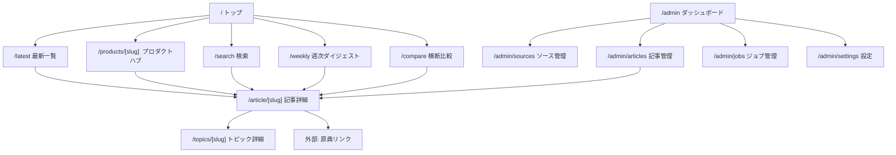

# 情報アーキテクチャ設計書 — aiaiai

> 最終更新: 2026-02-27
> ステータス: MVP設計確定

---

## 目次

1. [設計思想](#1-設計思想)
2. [サイト構造とページ一覧](#2-サイト構造とページ一覧)
3. [公開ページ詳細](#3-公開ページ詳細)
4. [管理画面詳細](#4-管理画面詳細)
5. [タグ・カテゴリ分類体系（Taxonomy）](#5-タグカテゴリ分類体系taxonomy)
6. [URL設計とルーティング](#6-url設計とルーティング)
7. [検索・フィルタ仕様](#7-検索フィルタ仕様)
8. [コンテンツ階層とユーザーフロー](#8-コンテンツ階層とユーザーフロー)
9. [モバイルナビゲーション設計](#9-モバイルナビゲーション設計)
10. [サイトマップ（視覚）](#10-サイトマップ視覚)

---

## 1. 設計思想

### 1.1 基本原則

aiaiai の情報アーキテクチャは以下の3原則に基づく。

| 原則 | 説明 |
|---|---|
| **判断優先** | 「読む」ではなく「判断する」ためのIA。一覧だけで要否が分かる構造 |
| **多軸アクセス** | 同一記事にプロダクト軸・テーマ軸・レベル軸・用途軸から到達可能 |
| **段階的深掘り** | 一覧（3行要約）→ 記事（詳細要約＋差分＋アクション）→ 原典リンク の3段構造 |

### 1.2 情報の優先順位

ページ設計・ナビゲーション・検索結果の全てにおいて、以下の優先度を適用する。

1. **信頼性**: 公式一次情報 > 準一次 > 二次 > SNS速報
2. **新規性**: 最新の更新が上位
3. **実務有用性**: 「今すぐ試すべき（Try）」 > 「監視（Monitor）」 > 「無視可（Ignore）」
4. **重要度**: 料金/規約/API変更 > UI改善 > マイナーバグ修正

### 1.3 ペルソナと情報ニーズの対応

| ペルソナ | 主な導線 | 重視する軸 |
|---|---|---|
| Biz実装層（企画/マーケ/CS） | トップ → 最新一覧（L1フィルタ）→ 記事 | テーマ軸・用途軸 |
| 開発導入層（エンジニア/PM） | プロダクトハブ → 記事 → 原典 | プロダクト軸・レベル軸 |
| 導入責任者層（情シス/経営） | 週次ダイジェスト → 横断比較 | テーマ軸（Pricing/Policy） |

---

## 2. サイト構造とページ一覧

### 2.1 全体構造図

```
aiaiai/
├── 公開ページ（(public) ルートグループ）
│   ├── /                          トップページ
│   ├── /latest                    最新記事一覧
│   ├── /article/[slug]            記事詳細
│   ├── /products/[slug]           プロダクトハブ
│   ├── /topics/[slug]             トピッククラスタ詳細
│   ├── /compare                   横断比較
│   ├── /weekly                    週次ダイジェスト
│   └── /search                    検索結果
│
├── 管理画面（(admin) ルートグループ）
│   ├── /admin                     ダッシュボード
│   ├── /admin/sources              ソース管理
│   ├── /admin/articles             記事管理
│   ├── /admin/jobs                 ジョブ管理
│   └── /admin/settings             設定
│
└── API（app/api/）
    ├── /api/cron/daily             日次収集Cron
    ├── /api/ingest/manual          手動取り込み
    ├── /api/search                 検索API
    └── /api/sitemap                サイトマップ生成
```

### 2.2 Next.js App Router ルートグループ

```
app/
├── (public)/           # 公開ページ用レイアウト（ヘッダー/フッター/ナビ）
│   └── layout.tsx      # 共通レイアウト: グローバルナビ + フッター
├── (admin)/            # 管理画面用レイアウト（サイドバー/認証ガード）
│   └── layout.tsx      # 管理用レイアウト: サイドバーナビ + 認証チェック
└── api/                # APIルート（レイアウトなし）
```

- `(public)` と `(admin)` はNext.jsのRoute Groupsにより、URLには含まれない
- レイアウトを分離することで、公開ページと管理画面のUI/認証を完全に独立させる

---

## 3. 公開ページ詳細

### 3.1 トップページ `/`

**目的**: サイトの価値を即座に伝え、最も重要な更新への導線を提供する。

| セクション | 内容 | 表示件数 |
|---|---|---|
| ヒーロー | サイトコンセプト + 検索バー | 1 |
| 注目の更新 | スコア上位の記事カード（3行要約＋バッジ） | 3〜5件 |
| プロダクト別ハイライト | ChatGPT / Claude / Gemini ごとの最新1件 | 各1件 |
| 最新記事 | 新着順リスト（タイトル＋日付＋プロダクト＋レベルバッジ） | 10件 |
| 週次ダイジェストCTA | 今週のまとめへの誘導 | 1 |

**レイアウト方針**:
- ファーストビューに検索バーと注目の更新を配置
- スクロールなしで「今週の最重要更新」が把握できる密度
- 各カードは3行要約＋推奨アクション（Try/Monitor/Ignore）バッジで即判断可能

### 3.2 最新記事一覧 `/latest`

**目的**: 時系列で全記事を閲覧でき、多軸フィルタで絞り込める。

| 要素 | 仕様 |
|---|---|
| デフォルト表示 | 新着順、全プロダクト、全レベル |
| フィルタ（上部） | プロダクト軸 / テーマ軸 / レベル軸 / 期間 / ソース種別 |
| ソート | 新着順 / 読む価値順 / 重要度順 / 緊急度順 |
| 記事カード | タイトル / 3行要約 / 公開日 / プロダクトタグ / レベルバッジ / アクションバッジ / 信頼度アイコン |
| ページネーション | 20件/ページ、ページ番号式（SEO対応） |
| URL状態管理 | フィルタ・ソート・ページをクエリパラメータで保持（`?product=claude&level=L3&sort=score&page=2`） |

**フィルタUI**:
- デスクトップ: 上部に横並びフィルタバー（ドロップダウン/チップ切替）
- モバイル: フィルタボタン → ボトムシート展開

### 3.3 記事詳細 `/article/[slug]`

**目的**: 1本の更新情報について、判断に必要な全情報を構造化して提示する。

```
┌─────────────────────────────────────────┐
│ [プロダクト] [テーマ] [レベル]           │  ← タグバッジ群
│                                         │
│ 記事タイトル                            │
│ 公開日 | 更新日 | 出典: 公式リリースノート │
│                                         │
│ ┌─────────────────────────────────────┐ │
│ │ 3行要約                             │ │  ← 一覧でも使う要約
│ └─────────────────────────────────────┘ │
│                                         │
│ ■ 何が変わったか（差分）                │
│   - 変更点1                             │
│   - 変更点2                             │
│                                         │
│ ■ 誰に影響があるか                      │
│   対象: エンジニア / PM                  │
│   レベル: L3（実装）                     │
│                                         │
│ ■ 実務でどう使えるか                    │
│   - ユースケース1                       │
│   - ユースケース2                       │
│                                         │
│ ■ 推奨アクション: Try / Monitor / Ignore │
│   理由: ...                             │
│                                         │
│ ■ 信頼度/重要度/緊急度                  │
│   [信頼: 高] [重要: 中] [緊急: 低]       │
│                                         │
│ ■ 原典リンク                            │
│   🔗 公式リリースノート（最優先）       │
│   🔗 関連GitHub Release                 │
│   🔗 関連記事                           │
│                                         │
│ ■ 関連トピック                          │
│   同一TopicCluster内の関連記事リスト    │
│                                         │
│ ■ 出典・引用情報                        │
│   出所明示 + 引用部分の明確な区別       │
└─────────────────────────────────────────┘
```

**SEO要素**:
- `<title>`: 記事タイトル — aiaiai
- `<meta name="description">`: 3行要約の先頭120文字
- `rel="canonical"`: `/article/[slug]` を正規URL
- OGP: タイトル / 要約 / プロダクト画像
- Article JSON-LD: 構造化データ

### 3.4 プロダクトハブ `/products/[slug]`

**目的**: 特定プロダクト（ChatGPT、Claude、Gemini等）に関する更新を集約したハブページ。

| slug例 | 対象プロダクト |
|---|---|
| `chatgpt` | ChatGPT / OpenAI UI更新 |
| `openai-api` | OpenAI Developers / API / SDK |
| `claude` | Claude Developer Platform / Claude Code |
| `gemini` | Gemini アプリ / Gemini API |

**ページ構成**:

| セクション | 内容 |
|---|---|
| プロダクトヘッダー | プロダクト名 / 概要 / 公式ソースリンク |
| 最新の更新 | 該当プロダクトの記事一覧（新着順、フィルタ付き） |
| テーマ別セクション | Update / Pricing / Policy 等のテーマ別グルーピング |
| タイムライン | 主要な更新を時系列で表示（簡易年表） |

**フィルタ**: テーマ軸 / レベル軸 / 期間でさらに絞り込み可能

### 3.5 トピッククラスタ `/topics/[slug]`

**目的**: 重複統合された1つのトピック（TopicCluster）の全体像を表示する。

**ページ構成**:
- トピックタイトル（代表記事のタイトル）
- 代表記事の詳細要約
- クラスタに含まれる全ソースの一覧（公式 > 準一次 > 二次 > SNS の順）
- 各ソースの信頼度・種別を明示
- 時系列での情報伝播フロー（最初の公式発表 → 各メディアの報道）

**用途**: 「同じ話題について複数ソースがある場合、結局どれを読めばいいか」を1ページで解決する。

### 3.6 横断比較 `/compare`

**目的**: ChatGPT / Claude / Gemini を横断的に比較し、意思決定を支援する。

**ページ構成**:

| セクション | 内容 |
|---|---|
| 比較テーブル | プロダクト × テーマ（Pricing/API/機能）のマトリクス |
| 最近の動向対比 | 直近1週間の各プロダクトの主要更新を並列表示 |
| テーマ別比較 | 「料金変更」「API更新」など特定テーマでの横断比較 |

**フィルタ**: 比較対象プロダクトの選択（2〜3製品）、テーマ選択、期間指定

### 3.7 週次ダイジェスト `/weekly`

**目的**: 1週間の更新をまとめて俯瞰できるダイジェストページ。

**ページ構成**:

| セクション | 内容 |
|---|---|
| 今週のハイライト | スコア上位3〜5件の要約カード |
| プロダクト別まとめ | 各プロダクトの今週の動きを簡潔にまとめ |
| テーマ別トレンド | 今週特に動きがあったテーマの集計 |
| 数値サマリ | 収集件数 / 公開記事数 / 注目トピック数 |
| バックナンバー | 過去の週次ダイジェストへのリンク |

**URL設計**: `/weekly` で最新の週を表示。過去分は `/weekly?week=2026-W08` のようにクエリパラメータで指定。

### 3.8 検索結果 `/search`

**目的**: キーワード検索＋多軸フィルタで目的の記事に到達する。

**ページ構成**:

| 要素 | 仕様 |
|---|---|
| 検索バー | クエリ入力（プレースホルダ: 「ChatGPT API 料金変更」） |
| フィルタ（サイドバー/上部） | プロダクト軸 / テーマ軸 / レベル軸 / 用途軸 / 期間 / ソース種別 |
| ソート | 関連度順（デフォルト）/ 新着順 / 読む価値順 |
| 検索結果カード | タイトル / ハイライト付き要約抜粋 / 日付 / タグ群 |
| ページネーション | 20件/ページ |
| 検索結果0件 | 提案（タグリンク/人気キーワード/検索Tips） |

**URL設計**: `/search?q=キーワード&product=claude&level=L3&sort=relevance&page=1`

---

## 4. 管理画面詳細

### 4.1 管理画面レイアウト

```
┌──────────┬─────────────────────────────────┐
│          │                                 │
│ サイド   │   メインコンテンツエリア         │
│ バーナビ │                                 │
│          │                                 │
│ ダッシュ │                                 │
│ ソース   │                                 │
│ 記事     │                                 │
│ ジョブ   │                                 │
│ 設定     │                                 │
│          │                                 │
│ ───────  │                                 │
│ サイトへ │                                 │
│          │                                 │
└──────────┴─────────────────────────────────┘
```

### 4.2 ダッシュボード `/admin`

**目的**: 運用状況を一目で把握し、要対応事項を確認する。

| ウィジェット | 内容 |
|---|---|
| 収集ステータス | 直近のジョブ実行結果（成功/失敗/件数） |
| 承認待ち記事 | ステータスが `draft` の記事数 + リンク |
| エラーアラート | 失敗ジョブ / レート制限超過 / ソース異常 |
| 統計サマリ | 今日の収集件数 / 公開記事数 / アクティブソース数 |
| 最近の監査ログ | 直近の操作ログ5件 |

### 4.3 ソース管理 `/admin/sources`

**目的**: 収集対象ソースのCRUDと監視。

| 機能 | 説明 |
|---|---|
| ソース一覧 | 名前 / 種別 / URL / 頻度 / 信頼スコア / ステータス / 最終取得日 |
| ソース追加 | 種別選択（official/rss/github/x）→ URL/設定入力 |
| ソース編集 | 取得頻度 / 信頼スコア / 規約メモの変更 |
| ソース停止/再開 | 即時停止（削除依頼対応等） |
| ソース詳細 | 取得履歴 / エラーログ / 取得済みRawItem一覧 |

**ソース種別の設定項目**:

| 種別 | 固有設定 |
|---|---|
| `official` | URL / CSSセレクタ（任意）/ フィードURL（任意） |
| `rss` | フィードURL |
| `github` | owner/repo / エンドポイント（releases/changelog） |
| `x` | アカウントID / 取得方式（API/埋め込み）/ 規約メモ（必須） |

### 4.4 記事管理 `/admin/articles`

**目的**: 記事のライフサイクル管理（承認・編集・非公開・削除）。

| 機能 | 説明 |
|---|---|
| 記事一覧 | タイトル / ステータス / スコア / プロダクト / 公開日 / 操作 |
| ステータス管理 | `draft` → `published` → `archived` / `hidden`（非公開） |
| 要約編集 | 3行要約 / 詳細要約 / 差分 / 影響 / アクション を手動修正 |
| 要約再生成 | ボタンで再生成を実行（自動→手動確認フロー） |
| タグ編集 | プロダクト / テーマ / レベル / 用途 タグの付け替え |
| 重複統合 | TopicCluster候補の提示 → 手動で統合/分離 |
| 削除/非公開 | 即時実行 + 理由入力（監査ログに記録） |

**フィルタ**: ステータス / プロダクト / 期間 / スコア範囲

**記事ステータス遷移**:

```
[収集] → draft → published → archived
                ↓
              hidden（非公開: 削除依頼/法務対応）
```

### 4.5 ジョブ管理 `/admin/jobs`

**目的**: 収集ジョブの実行状況・履歴・エラーの監視。

| 機能 | 説明 |
|---|---|
| ジョブ一覧 | ジョブ名 / ステータス / 開始日時 / 終了日時 / 取得件数 / エラー |
| ジョブ詳細 | 各ステージの処理結果 / エラーログ / バックオフ状態 |
| 手動実行 | 特定ソースの即座収集を実行 |
| 再実行 | 失敗ジョブの再実行（バックオフ設定を維持） |
| スケジュール確認 | Cron設定の確認（UTC/JST表示） |

**ステータス表示**:

| ステータス | 表示 | 色 |
|---|---|---|
| `pending` | 待機中 | グレー |
| `running` | 実行中 | 青 |
| `completed` | 完了 | 緑 |
| `failed` | 失敗 | 赤 |
| `retrying` | リトライ中 | 黄 |

### 4.6 設定 `/admin/settings`

**目的**: SEO設定、法務対応、システム設定を一元管理する。

| タブ | 機能 |
|---|---|
| 一般設定 | サイト名 / 説明文 / OGデフォルト画像 |
| SEO | グローバルtitle/description / robots.txt確認 / sitemap確認 |
| 法務対応 | 削除依頼一覧 / LegalEvent管理 / 対応履歴 |
| 監査ログ | 全操作ログの閲覧 / フィルタ / エクスポート |
| スコアリング | 各指標の重み設定（信頼性/重要度/新規性/実務有用性/緊急度） |

---

## 5. タグ・カテゴリ分類体系（Taxonomy）

### 5.1 設計方針

aiaiaiのタグは「飾り」ではなく、**フィルタ・検索・スコアリング・表示の全てに機能する分類軸**として設計する。

| 方針 | 説明 |
|---|---|
| **4軸独立** | プロダクト・テーマ・レベル・用途の4軸は独立しており、記事は各軸から1つ以上のタグを持つ |
| **必須付与** | プロダクト軸とテーマ軸は必須。レベル軸と用途軸は推奨 |
| **排他制御なし** | 同一軸内で複数タグ付与可能（例: ChatGPT + OpenAI API） |
| **段階的拡張** | MVPでは固定タグセット。将来はタグ提案・自動付与を導入 |

### 5.2 プロダクト軸（Product）

プロダクトごとの更新を追跡するための主軸。グローバルナビゲーションとプロダクトハブページに直結する。

| タグ名 | slug | 対象範囲 | ナビ表示 |
|---|---|---|---|
| ChatGPT | `chatgpt` | ChatGPT UI更新、機能追加、リリースノート | グローバルナビ |
| OpenAI API | `openai-api` | OpenAI API/SDK、Developers changelog | グローバルナビ |
| Claude | `claude` | Claude Developer Platform、Claude Code、SDK | グローバルナビ |
| Gemini | `gemini` | Gemini アプリ、Gemini API、モデル更新 | グローバルナビ |
| 開発ツール | `dev-tools` | エディタ拡張、CLI、OSS、周辺ツール | グローバルナビ |

**将来拡張候補**: Copilot、Mistral、Llama、Stable Diffusion など。プロダクト追加はソース追加と連動し、管理画面から可能にする。

### 5.3 テーマ軸（Theme）

更新の「種類」を分類する軸。何についての情報かを示す。

| タグ名 | slug | 定義 | 記事例 |
|---|---|---|---|
| アップデート | `update` | 機能追加、UI変更、バージョンアップ | 「ChatGPT に新機能○○追加」 |
| 料金・プラン | `pricing` | 料金体系変更、プラン改定、無料枠変更 | 「OpenAI API 料金改定」 |
| 規約・ポリシー | `policy` | 利用規約、プライバシーポリシー、コンプライアンス | 「Claude 利用規約更新」 |
| 使い方・活用 | `howto` | チュートリアル、ベストプラクティス、運用Tips | 「Gemini API 活用ガイド」 |
| セキュリティ | `security` | 脆弱性、セキュリティパッチ、認証変更 | 「OpenAI API 認証方式変更」 |

**将来拡張候補**: `performance`（性能改善）、`deprecation`（非推奨化）、`incident`（障害情報）

### 5.4 レベル軸（Level）

情報の「対象者レベル」を示す軸。ユーザーが自分に関係ある情報を素早く判別するためのフィルタ。

| タグ名 | slug | 定義 | 対象ペルソナ | UIバッジ色 |
|---|---|---|---|---|
| L1: 活用 | `l1` | UI機能、使い方、運用Tips、チーム展開、社内導入 | Biz実装層、導入責任者層 | 緑 |
| L2: 定着・自動化 | `l2` | ワークフロー化、ツール連携、運用設計、エージェント導入 | Biz実装層、開発導入層 | 青 |
| L3: 実装 | `l3` | API/SDK、互換性、セキュリティ、移行、破壊的変更 | 開発導入層 | 紫 |

**分類基準（ブレ防止ルール）**:

| 判定条件 | レベル |
|---|---|
| UIの操作方法/新機能の紹介が主体 | L1 |
| 外部ツールとの連携/自動化設定が主体 | L2 |
| コード変更/API仕様変更/SDK更新が主体 | L3 |
| 料金/規約/ポリシー変更 | 内容に応じてL1〜L3（影響範囲で判定） |

**複数レベルの付与**: 1つの更新が複数レベルに影響する場合は複数付与可能。例:「APIの料金改定」はL1（利用料影響）+ L3（API実装変更）。

### 5.5 実務用途軸（Use-case）

情報が「誰の業務に関係するか」を示す軸。レコメンドや通知のパーソナライズに将来的に活用する。

| タグ名 | slug | 対象職種・業務 | 関心テーマ例 |
|---|---|---|---|
| 経営 | `management` | 経営層、役員、事業責任者 | Pricing、Policy、市場動向 |
| 企画 | `planning` | 企画、マーケティング、プロダクト企画 | 新機能活用、競合動向、How-to |
| 開発 | `engineering` | エンジニア、SRE、DevOps | API変更、SDK、Security、破壊的変更 |
| CS | `cs` | カスタマーサポート、カスタマーサクセス | UI変更、新機能、活用Tips |
| 法務 | `legal` | 法務、コンプライアンス、情シス | Policy、Security、利用規約 |

### 5.6 タグの組み合わせ例

| 記事タイトル例 | プロダクト | テーマ | レベル | 用途 |
|---|---|---|---|---|
| ChatGPT に画像生成機能追加 | `chatgpt` | `update` | `l1` | `planning`, `cs` |
| OpenAI API v2 料金改定 | `openai-api` | `pricing` | `l1`, `l3` | `management`, `engineering` |
| Claude Code SDK 破壊的変更 | `claude` | `update`, `security` | `l3` | `engineering` |
| Gemini 利用規約 改定 | `gemini` | `policy` | `l1` | `management`, `legal` |
| Claude API ワークフロー自動化ガイド | `claude` | `howto` | `l2` | `planning`, `engineering` |

### 5.7 データモデル上の実装

タグはDBの `Tag` テーブルに格納し、`axis` フィールドで軸を区別する。

```
Tag
├── id: UUID
├── axis: Enum('product', 'theme', 'level', 'usecase')
├── name: String        # 日本語表示名
├── slug: String        # URL/フィルタ用
├── description: String # 定義（分類ブレ防止用）
├── sortOrder: Int      # 表示順
├── createdAt: DateTime
└── updatedAt: DateTime

ArticleTag（多対多中間テーブル）
├── articleId: UUID → Article
└── tagId: UUID → Tag
```

---

## 6. URL設計とルーティング

### 6.1 URL設計方針

| 方針 | 説明 |
|---|---|
| **人間可読** | slugは英数字・ハイフンで構成し、内容を推測可能にする |
| **階層表現** | パスで情報のカテゴリ/種別を示す（`/products/claude`、`/article/claude-code-v2-release`） |
| **状態のURL化** | フィルタ・ソート・ページはクエリパラメータで保持（ブックマーク/共有可能） |
| **正規化** | 末尾スラッシュなし、小文字統一、canonical設定 |
| **SEO最適** | 静的パスはISR/SSGで生成、動的パスはSSR |

### 6.2 公開ページURL一覧

| パス | パラメータ | 例 |
|---|---|---|
| `/` | なし | — |
| `/latest` | `?product=&theme=&level=&period=&sort=&page=` | `/latest?product=claude&level=l3&sort=score` |
| `/article/[slug]` | slug: 記事スラグ | `/article/chatgpt-image-gen-2026-02` |
| `/products/[slug]` | slug: プロダクトスラグ | `/products/claude` |
| `/topics/[slug]` | slug: トピッククラスタスラグ | `/topics/openai-api-v2-pricing` |
| `/compare` | `?products=&theme=&period=` | `/compare?products=chatgpt,claude&theme=pricing` |
| `/weekly` | `?week=` | `/weekly?week=2026-W09` |
| `/search` | `?q=&product=&theme=&level=&usecase=&sort=&page=` | `/search?q=API料金&product=openai-api` |

### 6.3 管理画面URL一覧

| パス | 説明 |
|---|---|
| `/admin` | ダッシュボード |
| `/admin/sources` | ソース一覧・管理 |
| `/admin/sources/new` | ソース新規追加 |
| `/admin/sources/[id]` | ソース詳細・編集 |
| `/admin/articles` | 記事一覧・管理 |
| `/admin/articles/[id]` | 記事詳細・編集 |
| `/admin/jobs` | ジョブ一覧 |
| `/admin/jobs/[id]` | ジョブ詳細 |
| `/admin/settings` | 設定（タブ切替: 一般/SEO/法務/監査/スコア） |

### 6.4 APIエンドポイントURL一覧

| パス | メソッド | 説明 |
|---|---|---|
| `/api/cron/daily` | `GET` | 日次収集Cron（Vercel Cronから呼び出し） |
| `/api/ingest/manual` | `POST` | 手動取り込み（管理画面から呼び出し） |
| `/api/search` | `GET` | 検索API（クエリパラメータでフィルタ） |
| `/api/sitemap` | `GET` | サイトマップXML生成 |

### 6.5 slug生成ルール

**記事slug**: `{プロダクト}-{タイトル要約}-{年月}` 形式を基本とする。

| ルール | 例 |
|---|---|
| 英数字・ハイフンのみ | `chatgpt-image-gen-update-2026-02` |
| 最大60文字 | 超過時は末尾を切り詰め |
| 重複時はサフィックス追加 | `-2`, `-3` |
| 日本語はローマ字化しない | タイトルから英語キーワードを抽出 |

**プロダクトslug**: タグの `slug` フィールドと一致させる（`chatgpt`, `claude`, `gemini` 等）。

**トピックslug**: 代表記事のslugに `topic-` プレフィックスを付与、または独立したクラスタキーを使用。

---

## 7. 検索・フィルタ仕様

### 7.1 検索基盤（MVP: PostgreSQL FTS）

MVPではPostgreSQLの全文検索（Full Text Search）を使用する。将来的にMeilisearch等の専用検索エンジンに差し替え可能な抽象化レイヤーを設ける。

#### 検索対象フィールド

| フィールド | 重み | 根拠 |
|---|---|---|
| `title` | A（最高） | タイトル一致は最も強い意図シグナル |
| `summary3`（3行要約） | B | 要約に含まれるキーワードは高関連 |
| `summaryLong`（詳細要約） | C | 本文相当の検索対象 |
| `whatChanged`（差分） | C | 技術的キーワードの補完 |
| Tag名（結合） | B | プロダクト名・テーマ名での検索 |

#### PostgreSQL FTS実装方針

```sql
-- tsvectorカラムを追加（日本語対応）
ALTER TABLE "Article" ADD COLUMN search_vector tsvector;

-- インデックス作成
CREATE INDEX idx_article_search ON "Article" USING GIN(search_vector);

-- 更新トリガー（記事保存時に自動更新）
CREATE OR REPLACE FUNCTION update_search_vector() RETURNS trigger AS $$
BEGIN
  NEW.search_vector :=
    setweight(to_tsvector('simple', COALESCE(NEW.title, '')), 'A') ||
    setweight(to_tsvector('simple', COALESCE(NEW.summary3, '')), 'B') ||
    setweight(to_tsvector('simple', COALESCE(NEW.summary_long, '')), 'C') ||
    setweight(to_tsvector('simple', COALESCE(NEW.what_changed, '')), 'C');
  RETURN NEW;
END;
$$ LANGUAGE plpgsql;
```

**日本語検索の対応**:
- MVPでは `simple` 辞書 + bigramトークナイザ（pg_bigm拡張、または手動分割）を使用
- 将来的には `pg_bigm` または外部検索エンジン（Meilisearch）で高精度化

#### 検索APIインターフェース

```typescript
// GET /api/search
interface SearchParams {
  q: string;              // 検索クエリ（必須）
  product?: string;       // プロダクト軸フィルタ（カンマ区切り）
  theme?: string;         // テーマ軸フィルタ（カンマ区切り）
  level?: string;         // レベル軸フィルタ（カンマ区切り）
  usecase?: string;       // 用途軸フィルタ（カンマ区切り）
  source_type?: string;   // ソース種別（official/rss/github/x）
  period?: string;        // 期間（7d/30d/90d/all）
  sort?: 'relevance' | 'newest' | 'score' | 'importance';
  page?: number;          // ページ番号（1始まり）
  per_page?: number;      // 1ページあたり件数（デフォルト20、最大50）
}

interface SearchResponse {
  results: ArticleSummary[];
  total: number;
  page: number;
  per_page: number;
  query: string;
  filters_applied: Record<string, string[]>;
}
```

### 7.2 フィルタ仕様

#### フィルタの種類と動作

| フィルタ | タイプ | 動作 | UI |
|---|---|---|---|
| プロダクト軸 | 複数選択 | OR結合（選択したプロダクトのいずれかに該当） | チップ切替 |
| テーマ軸 | 複数選択 | OR結合 | チップ切替 |
| レベル軸 | 複数選択 | OR結合 | チップ切替（色付きバッジ） |
| 用途軸 | 複数選択 | OR結合 | ドロップダウン |
| ソース種別 | 単一選択 | 指定種別のみ表示（「公式のみ」が特に重要） | ドロップダウン |
| 期間 | 単一選択 | 指定期間内のみ | プリセットボタン（7日/30日/90日/全期間） |

#### フィルタ間の結合ルール

- **軸間**: AND結合（プロダクト=Claude AND テーマ=Pricing → Claudeの料金関連のみ）
- **軸内**: OR結合（プロダクト=Claude,ChatGPT → ClaudeまたはChatGPTの記事）
- **検索クエリ + フィルタ**: AND結合（検索結果をフィルタでさらに絞り込み）

#### フィルタのURL永続化

全てのフィルタ状態はクエリパラメータに反映し、URLの共有/ブックマークを可能にする。

```
/latest?product=claude,chatgpt&theme=pricing&level=l3&period=30d&sort=score&page=1
```

### 7.3 ソート仕様

| ソートキー | パラメータ値 | ロジック |
|---|---|---|
| 新着順 | `newest` | `publishedAt` 降順 |
| 読む価値順 | `score` | 合成スコア（読む価値スコア）降順 |
| 重要度順 | `importance` | 重要度スコア降順 |
| 緊急度順 | `urgency` | 緊急度スコア降順 |
| 関連度順 | `relevance` | PostgreSQL FTSのランクスコア降順（検索時のみ） |

### 7.4 将来の検索拡張（P1以降）

| 機能 | 優先度 | 技術 |
|---|---|---|
| 日本語形態素解析 | P1 | pg_bigm または Meilisearch |
| オートコンプリート | P1 | 前方一致 + 人気キーワード |
| ファセットカウント | P1 | 各フィルタの該当件数表示 |
| 類似記事検索 | P2 | 埋め込みベクトル（pgvector） |
| 検索ログ分析 | P2 | 検索クエリの記録と分析 |

---

## 8. コンテンツ階層とユーザーフロー

### 8.1 コンテンツ階層

情報は3段階の深さで構造化する。

```
レベル1: 概観（Overview）
├── トップページ: 最重要更新のハイライト
├── 週次ダイジェスト: 1週間のまとめ
└── 横断比較: プロダクト間の対比

レベル2: 一覧（List）
├── 最新記事一覧: フィルタ・ソート付き全記事
├── プロダクトハブ: プロダクト別の記事一覧
├── 検索結果: キーワード検索結果
└── トピック一覧: クラスタ化されたトピック群

レベル3: 詳細（Detail）
├── 記事詳細: 構造化された要約・差分・アクション
├── トピック詳細: クラスタ内の全ソースと時系列
└── 原典リンク（外部サイト）: 公式ソースへの遷移
```

### 8.2 主要ユーザーフロー

#### フロー1: 「今日の重要更新を素早く確認したい」（Biz実装層）

```
トップページ
  → 注目の更新カード（3行要約を確認）
    → [詳しく見る] 記事詳細ページ
      → 何が変わったか / 誰に影響 / どう使えるか を確認
        → [原典を確認] 公式リリースノートへ遷移
```

#### フロー2: 「特定プロダクトのAPI変更を追いたい」（開発導入層）

```
グローバルナビ → [Claude]
  → プロダクトハブ /products/claude
    → レベルフィルタで [L3: 実装] を選択
      → 記事一覧から該当記事を選択
        → 記事詳細（差分・破壊的変更・移行手順を確認）
          → 原典リンクから公式ドキュメントへ
```

#### フロー3: 「料金変更を横断的に把握したい」（導入責任者層）

```
グローバルナビ → [比較]
  → 横断比較 /compare
    → テーマ [料金・プラン] を選択
      → ChatGPT / Claude / Gemini の料金変更を並列比較
        → 気になる記事の詳細へ遷移
```

#### フロー4: 「特定のキーワードで情報を探したい」

```
ヘッダー検索バー → キーワード入力
  → 検索結果 /search?q=キーワード
    → フィルタで絞り込み（プロダクト/テーマ/レベル）
      → 記事詳細へ遷移
```

#### フロー5: 「1週間分をまとめて確認したい」

```
トップページ → [週次ダイジェスト] CTA
  → 週次ダイジェスト /weekly
    → ハイライト3〜5件を確認
      → プロダクト別まとめで気になる項目を確認
        → 記事詳細へ遷移
```

### 8.3 ナビゲーション導線の設計

#### グローバルナビゲーション（全ページ共通）

```
┌─────────────────────────────────────────────────────────────────┐
│ [ロゴ aiaiai]  最新  ChatGPT  Claude  Gemini  比較  週次  [🔍] │
└─────────────────────────────────────────────────────────────────┘
```

| 項目 | リンク先 | 役割 |
|---|---|---|
| ロゴ | `/` | トップページへ戻る |
| 最新 | `/latest` | 全記事の時系列一覧 |
| ChatGPT | `/products/chatgpt` | ChatGPTハブ |
| Claude | `/products/claude` | Claudeハブ |
| Gemini | `/products/gemini` | Geminiハブ |
| 比較 | `/compare` | 横断比較 |
| 週次 | `/weekly` | 週次ダイジェスト |
| 検索アイコン | `/search`（または検索バー展開） | 検索 |

#### パンくずリスト

全ての詳細ページにパンくずリストを設置する。

```
トップ > Claude > Claude Code SDK 破壊的変更
トップ > 最新記事 > ChatGPT 画像生成機能追加
トップ > 週次ダイジェスト > 2026年第9週
トップ > トピック > OpenAI API v2 料金改定
```

#### 記事間の回遊導線

| 導線 | 表示位置 | 内容 |
|---|---|---|
| 関連記事 | 記事詳細の末尾 | 同一TopicCluster / 同一プロダクト / 同一テーマ |
| 前後の記事 | 記事詳細の末尾 | 同一プロダクト内の前後の更新 |
| タグリンク | 記事詳細のタグバッジ | クリックで該当タグのフィルタ済み一覧へ |

---

## 9. モバイルナビゲーション設計

### 9.1 設計方針

| 方針 | 説明 |
|---|---|
| **モバイルファースト** | 主要ユーザーのスマホ利用を想定し、モバイルUIを先に設計 |
| **下部ナビ** | 親指操作を最適化するため、主要導線は画面下部に配置 |
| **最小タップ** | 目的の情報に最少タップで到達できる構造 |
| **スクロール疲労防止** | 一覧ページのカードは情報密度を高め、スクロール量を抑制 |

### 9.2 モバイル画面構成

#### ヘッダー（固定）

```
┌─────────────────────────────────┐
│ [≡]  aiaiai           [🔍]     │
└─────────────────────────────────┘
```

- ハンバーガーメニュー: プロダクト一覧 / テーマ一覧 / 設定等
- 検索アイコン: タップで検索バー展開（全画面オーバーレイ）

#### ボトムナビゲーション（固定）

```
┌─────────────────────────────────┐
│  🏠     📋     🔄     📊     📅 │
│ ホーム  最新  プロダクト 比較   週次 │
└─────────────────────────────────┘
```

| アイコン | ラベル | リンク先 |
|---|---|---|
| ホーム | ホーム | `/` |
| 最新 | 最新 | `/latest` |
| プロダクト | プロダクト | プロダクト選択シート展開 |
| 比較 | 比較 | `/compare` |
| 週次 | 週次 | `/weekly` |

#### プロダクト選択（ボトムシート）

「プロダクト」タップ時にボトムシートを展開し、プロダクト一覧を表示。

```
┌─────────────────────────────────┐
│ プロダクトを選択                │
│ ─────────────────────────────── │
│ ChatGPT                    →   │
│ OpenAI API                 →   │
│ Claude                     →   │
│ Gemini                     →   │
│ 開発ツール                 →   │
└─────────────────────────────────┘
```

### 9.3 モバイルフィルタUI

最新一覧 `/latest` や検索結果 `/search` のフィルタは、モバイルではボトムシートで展開する。

#### フィルタ展開前

```
┌─────────────────────────────────┐
│ [フィルタ ▼]  [新着順 ▼]        │
│ 適用中: Claude, L3              │
└─────────────────────────────────┘
```

#### フィルタ展開後（ボトムシート）

```
┌─────────────────────────────────┐
│ フィルタ                [リセット] │
│ ─────────────────────────────── │
│ プロダクト                       │
│ [ChatGPT] [Claude✓] [Gemini]   │
│ [OpenAI API] [開発ツール]       │
│                                 │
│ テーマ                           │
│ [Update] [Pricing] [Policy]     │
│ [How-to] [Security]             │
│                                 │
│ レベル                           │
│ [L1:活用] [L2:定着] [L3:実装✓]  │
│                                 │
│ 期間                             │
│ [7日] [30日] [90日] [全期間]     │
│                                 │
│        [適用する（12件）]         │
└─────────────────────────────────┘
```

- フィルタ適用前に該当件数をプレビュー表示
- 「リセット」で全フィルタをクリア
- 「適用する」で一覧を更新しボトムシートを閉じる

### 9.4 モバイル記事カード

一覧での記事カードはモバイルで情報密度を保ちつつ、可読性を確保する。

```
┌─────────────────────────────────┐
│ [Claude] [Update] [L3]          │ ← タグバッジ（小）
│                                 │
│ Claude Code SDK v3.0            │ ← タイトル（太字）
│ 破壊的変更あり                  │
│                                 │
│ 認証方式がOAuth2に変更。既存の  │ ← 3行要約（最大3行）
│ APIキー認証は6月末で廃止予定。  │
│ 移行ガイドが公式に公開済み。    │
│                                 │
│ 🟢 Try  │ 信頼:高 │ 2/27      │ ← アクション/信頼度/日付
└─────────────────────────────────┘
```

### 9.5 モバイル検索UI

検索アイコンタップ時に全画面オーバーレイで検索UIを展開する。

```
┌─────────────────────────────────┐
│ [←]  [検索キーワードを入力___] [🔍] │
│                                 │
│ 最近の検索                       │
│ ・ChatGPT API 料金              │
│ ・Claude Code 破壊的変更         │
│ ・Gemini 新機能                  │
│                                 │
│ 人気のキーワード                 │
│ [API変更] [料金改定] [新機能]    │
│ [セキュリティ] [SDK更新]         │
│                                 │
│ プロダクトから探す               │
│ [ChatGPT] [Claude] [Gemini]     │
└─────────────────────────────────┘
```

### 9.6 レスポンシブブレークポイント

| ブレークポイント | 幅 | ナビ | フィルタ | カード |
|---|---|---|---|---|
| モバイル | 〜639px | ボトムナビ + ハンバーガー | ボトムシート | 1カラム |
| タブレット | 640〜1023px | 上部ナビ（コンパクト） | サイドバー（折りたたみ可） | 2カラム |
| デスクトップ | 1024px〜 | 上部ナビ（フル） | サイドバー（常時表示） | 2〜3カラム |

---

## 10. サイトマップ（視覚）

### 10.1 全体サイトマップ



### 10.2 SEO用XMLサイトマップ構成

```xml
<!-- /api/sitemap で動的生成 -->
<urlset>
  <!-- 静的ページ -->
  <url><loc>/</loc><changefreq>daily</changefreq><priority>1.0</priority></url>
  <url><loc>/latest</loc><changefreq>daily</changefreq><priority>0.9</priority></url>
  <url><loc>/compare</loc><changefreq>weekly</changefreq><priority>0.7</priority></url>
  <url><loc>/weekly</loc><changefreq>weekly</changefreq><priority>0.8</priority></url>
  <url><loc>/search</loc><changefreq>monthly</changefreq><priority>0.5</priority></url>

  <!-- プロダクトハブ -->
  <url><loc>/products/chatgpt</loc><changefreq>daily</changefreq><priority>0.8</priority></url>
  <url><loc>/products/claude</loc><changefreq>daily</changefreq><priority>0.8</priority></url>
  <url><loc>/products/gemini</loc><changefreq>daily</changefreq><priority>0.8</priority></url>

  <!-- 記事（動的生成） -->
  <url><loc>/article/[slug]</loc><changefreq>weekly</changefreq><priority>0.7</priority></url>
  <!-- ... -->

  <!-- トピック（動的生成） -->
  <url><loc>/topics/[slug]</loc><changefreq>weekly</changefreq><priority>0.6</priority></url>
  <!-- ... -->
</urlset>
```

---

## 付録

### A. 用語集

| 用語 | 定義 |
|---|---|
| TopicCluster | 同一話題に関する複数ソースを統合した単位。代表記事1本＋関連ソースで構成 |
| RawItem | 収集した生データ。正規化・重複判定前の状態 |
| Article | 公開単位。TopicClusterから生成された要約・スコア付き記事 |
| slug | URL用の英数字ハイフン識別子 |
| 読む価値スコア | 信頼性・重要度・新規性・実務有用性・緊急度の加重合成スコア（0-100） |
| 推奨アクション | Try（今すぐ試す）/ Monitor（注視する）/ Ignore（スキップ可） |

### B. 関連ドキュメント

| ドキュメント | パス | 内容 |
|---|---|---|
| プロジェクトブリーフ | `docs/project-brief.md` | 要件定義・成功基準 |
| データモデル | `docs/data-model.md` | DB設計詳細 |
| 収集アーキテクチャ | `docs/ingestion-architecture.md` | パイプライン設計 |
| スコアリング設計 | `docs/scoring-ranking-design.md` | スコア算出ロジック |
| 管理画面仕様 | `docs/admin-console-spec.md` | 管理画面の詳細仕様 |
| デザインシステム | `docs/design-system.md` | UI/UXガイドライン |
| SEO戦略 | `docs/seo-strategy.md` | SEO実装方針 |
| コンテンツ戦略 | `docs/content-strategy.md` | 要約・引用・出典ルール |
